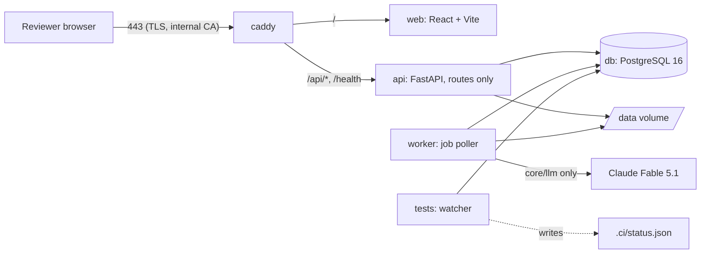

# Architecture

Kept current in the same commit as the code that changes it. Sources of authority: the invariants and locked decisions in `CLAUDE.md`, the inheritance choices in `docs/INHERITANCE.md`, dated decisions in `docs/DECISIONS.md`.

## Components

| Service | Image | Command | Notes |
| --- | --- | --- | --- |
| `db` | `postgres:16` | default | databases `tender` (app) and `tender_ci` (watcher and pytest) |
| `api` | `infra/docker/Dockerfile.python` (target `app`) | `uvicorn api.main:create_app --factory` | routes only; no business logic, no LLM calls |
| `worker` | same image | `python -m worker.main` | one process; polls `job` every 2 s and runs the parse → section map → extract → validate chain |
| `web` | `infra/docker/Dockerfile.web` | Vite dev server | calls `/api/v1/*` through `web/src/api/` only |
| `caddy` | `caddy:2` | `infra/Caddyfile` | TLS with Caddy's internal CA on the static IP |
| `tests` | `infra/docker/Dockerfile.python` (target `tests`: dev dependencies plus Node) | `python infra/ci/run_checks.py --watch` | the continuous test pipeline |

## Repository layout

The layout in `CLAUDE.md` is authoritative. Additions made under operating rule 9 (folder added here first, then the code):

| Folder | Purpose | Added |
| --- | --- | --- |
| `infra/docker/` | `Dockerfile.python` (targets `app` and `tests`) and `Dockerfile.web` | Stage 0B |
| `infra/ci/` | `run_checks.py`, the watcher that writes `.ci/status.json` | Stage 0B |
| `infra/hooks/` | git hooks; `pre-commit` blocks a commit over a red or missing status | Stage 0B |
| `infra/db/` | Postgres init script that creates the `tender_ci` database | Stage 0B |
| `core/config.py`, `core/db.py` | settings and engine/session factories shared by api, worker and scripts | Stage 0B |
| `api/v1/schemas/` | Pydantic I/O models for the routers (named in the layout comment for `api/v1/`) | Stage 0B |
| `core/schemas/` | the extraction schema model (`FieldDef`, `FieldGroup`, `ExtractionSchema`), value types and the `SchemaRegistry`; a schema is data handed to core, which knows nothing about tenders | Stage 1 |
| `web/src/api/openapi.json`, `schema.d.ts` | generated by `make client` from the API; the watcher's `openapi_drift` check fails when they are stale | Stage 0B |
| `migrations/` | Alembic environment and versions (one migration history for core and tender) | Stage 0B |

## Data model

| Table | Purpose | Who writes it | Stage |
| --- | --- | --- | --- |
| `tenant` | one row per tenant; `ergplan` seeded by migration 0001 | migration only | 0B |
| `llm_call_log` | one row per LLM call: prompt name and version, model, input hash, output, tokens, latency, status, request id, `extraction_run_id` (added in 0002) | `core.llm.client.LLMClient.call` only | 0B, 1 |
| `document` | an uploaded PDF: sha256 (unique per tenant), filename, mime, page_count, storage_path, status `uploaded/parsed/failed`, error | `IngestService.upload`; status and page_count by `ParseService.parse` | 1 |
| `page` | per page: text, width and height in PDF points, `render_path` (PNG at 150 dpi), `char_boxes` (one `[x0, top, x1, bottom]` per character of `text`, null for layout whitespace), `has_text_layer` | `ParseService.parse` | 1 |
| `section` | contiguous page range with heading, free-text `kind`, confidence, prompt version | `SectionMapper.map` | 1 |
| `extraction_run` | one extraction of one document with one schema and prompt version, for one object (`object_type`, `object_id`, `object_version`); status `queued/running/extracted/validated/failed`, tokens, cost | `ExtractService.start_run` and `.extract`; `ValidationService.validate` sets `validated` | 1 |
| `candidate` | model output for one field: value (jsonb), value_type, confidence, rationale, status `raw/validated/needs_review/superseded/not_found/rejected`, prompt name and version, the call log row, the page window | inserted by `ExtractService` only; **immutable** except `status` (trigger `candidate_immutable`) | 1 |
| `evidence_span` | where the value is written: document, page, bbox, char range, quote, how it was located (`stated_page/adjacent_page/window_page/unresolved`), match score | inserted by `ExtractService` only; **append-only** (trigger) | 1 |
| `validation_result` | one row per rule per candidate: rule name, passed, message | `ValidationService.validate` | 1 |
| `approval` | a reviewer's decision `approved/edited/not_in_document/rejected` with final value, reviewer, note; `active` or `superseded` | `ApprovalService.approve` only | 1 |
| `canonical_fact` | truth: object, version, field, value, value_type, approval, evidence copied from the candidate (plus the reviewer's decision when it was not a plain approval), `is_current` | **`ApprovalService.approve` only** | 1 |
| `feedback` | candidate value, final value, `delta_kind` (`format/wrong_value/missing/extra`), reviewer, prompt version | `ApprovalService.approve` only; nothing reads it at runtime | 1 |
| `audit_log` | actor, action, table, row id, before, after, at | `core.services.audit.record`, called by extract, validate and approve; **append-only** (trigger) | 1 |
| `job` | kind, payload, status `queued/running/done/failed`, attempts, max_attempts, last_error, run_after | `core.services.jobs` | 1 |

Every table carries `tenant_id`, `created_at`, `created_by` through `core.models.base.TenantAuditMixin`; a test fails if a table is added without them.

Invariants the database itself enforces (migration 0002): a `candidate` row can be neither deleted nor updated in any column but `status`; `evidence_span` and `audit_log` rows can be neither updated nor deleted. Tests in `tests/core/test_invariants.py` try each and expect the refusal.

A candidate, approval and canonical fact belong to an **object** (`object_type`, `object_id`, `object_version`). In Stage 1 the object is the document itself (`object_type = "document"`, version 1). Stage 2 passes `tender` and the tender version number, which is how a canonical fact becomes attached to a tender version without core knowing what a tender is.

## Truth pipeline

| Step | Function | Writes |
| --- | --- | --- |
| upload | `core.services.ingest.IngestService.upload` | `document`, file in storage, `job(parse)`. Same sha256 returns the existing document |
| parse | `core.services.parse.ParseService.parse` | `page` rows (pdfplumber text and character boxes, pymupdf render), `document.status = parsed`, `job(section_map)` |
| section map | `core.services.section_map.SectionMapper.map` | `section` rows from one model call over a digest of every page (first 400 characters plus heading-like lines) |
| start run | `core.services.extract.ExtractService.start_run` | `extraction_run`, `job(extract)`. Refuses an unknown schema or an unregistered prompt version |
| extract | `core.services.extract.ExtractService.extract` | per field group: pages chosen by `select_pages` from the group's routing hints, sent as a native PDF of at most 40 pages per call; output model built by `build_group_model` requires value, confidence, rationale and evidence for every field. Inserts `candidate` and `evidence_span`, then `job(validate)` |
| locate evidence | `core.services.evidence.locate`, driven by `ExtractService._resolve` | each quote is matched on the stated page, then the adjacent pages, then the rest of the window (exact after normalisation, then rapidfuzz, threshold 85). Unlocated: the span is stored as `unresolved` and the candidate's confidence is capped at 0.3 |
| validate (deterministic) | `core.services.validate.ValidationService.validate` | `validation_result` rows: `evidence_located` or `evidence_not_located`, `type`, `range`, `regex`, `required_present`, and the schema's cross-field rules. Sets `candidate.status` to `validated` or `needs_review`. No model call |
| read model | `core.services.review_state.ReviewStateService.for_object` | nothing; returns every schema field with its best candidate, evidence, validation results and active approval |
| approve → `canonical_fact` (only writer) | `core.services.approve.ApprovalService.approve` | `approval`, `canonical_fact` (for approved, edited, not_in_document), `feedback` when the final value differs (`classify_delta`), `audit_log`. A later decision supersedes the earlier approval and its fact. An identical repeat writes nothing |

Candidate outcomes that never reach a reviewer as a value: `not_found` (the model returned null; shown as "no value" and can be decided as edited or not_in_document) and `rejected` (a value came with no quote; stored for the record, never shown, cannot be approved).

A schema is data handed to core: `core.schemas.ExtractionSchema` (field groups with routing hints, fields with value type, unit, range and regex) registered in a `SchemaRegistry` together with any cross-field rules. Core names no tender field. In Stage 1 the deployed API and worker start with an empty registry; the tender schemas are registered in Stage 2. Tests register a small contract schema and, for the end-to-end run, a 12-field FDRE schema (`tests/fixtures/`).

The LLM boundary is unchanged from Stage 0B: `core.llm.client.LLMClient.call(LLMRequest) -> LLMResponse` loads a registered prompt version through `core.llm.registry.load_prompt`, calls the model with a Pydantic output schema, and writes `llm_call_log` for every outcome including failures. Nothing else in the codebase may call the Anthropic SDK. Prompts: `core/llm/prompts/section_map/v1.md`, `core/llm/prompts/extract/v1.md`.

## API surface

| Router | Routes | Stage |
| --- | --- | --- |
| `api/v1/core/health.py` | `GET /health`, `GET /api/v1/health` | 0B |
| `api/v1/core/documents.py` | `POST /api/v1/documents` (multipart), `GET /api/v1/documents/{id}`, `GET /api/v1/documents/{id}/pages/{n}/render`, `GET /api/v1/documents/{id}/sections` | 1 |
| `api/v1/core/extraction.py` | `POST /api/v1/documents/{id}/extract`, `GET /api/v1/extraction-runs/{id}` | 1 |
| `api/v1/core/review.py` | `GET /api/v1/review-state`, `POST /api/v1/approvals`, `GET /api/v1/canonical` | 1 |

Tenant resolution is the request dependency `api.deps.get_tenant_id`, which returns the configured single tenant in phase 1. Errors go through `api/middleware/errors.py`: a request id on every response and a typed error payload. The reviewer of an approval comes from the `X-Reviewer` header in phase 1 (`api.deps.get_reviewer`); the Stage 3 token middleware will set it. The API never calls the model: it queues jobs and reads state.

## Tender documents and roles (decided 2026-10-04, built in Stage 2)

A `tender_version` owns many documents through a link table, each with a role. This refines the Stage 2 prompt, which gave `tender_version` a single `document_id`.

| Table | Columns | Notes |
| --- | --- | --- |
| `tender_version` | tender_id, version_no, kind (original/corrigendum/amendment/clarification), issued_on, summary_of_change, supersedes_version_id | no `document_id` column |
| `tender_version_document` | tender_version_id, document_id, role | role is one of `rfs`, `amendment`, `clarification`, `ppa`, `psa`, `cfda`, `technical`, `contractual`, `nit` |

- The original version of a SECI tender typically holds the RfS plus its standard PPA and PSA (or CfDA). An EPC tender holds a contractual and a technical document. A corrigendum, amendment or clarification still creates a new version with its own document; it is never attached to an existing version.
- Extraction routes each field group to documents by role. Commercial-section fields (payment security, change in law, termination compensation) may be routed to the `ppa` document.
- Nothing changes in the evidence model: an `evidence_span` already names a document id, so a canonical fact shows which document, page and box it came from.
- The roles are the same vocabulary used in `/work/tenders/<type>/<slug>/manifest.yaml`.

## Independent review (operating rule 15, from Stage 1)

Before each stage report, a reviewer from a different model family (OpenAI through `OPENAI_API_KEY`) runs in a fresh context. It receives only the stage diff (`git diff stage-N-start..HEAD`), `CLAUDE.md` and the stage prompt, and answers a fixed five-point checklist. Every finding is fixed and the reviewer is rerun until it reports none; findings and fixes go into the stage report under "Independent review". Stage starts are tagged `stage-N-start`.

## Job chain

`worker.runner.Runner` claims one due job at a time (`core.services.jobs.claim_next`, `FOR UPDATE SKIP LOCKED`) and runs its handler. Each step enqueues the next:

`upload` → `parse` → `section_map`, and `start_run` → `extract` → `validate`.

A failure is stored with its traceback in `job.last_error`. A retryable failure is re-queued with backoff (30 s, 60 s) up to `max_attempts` (3); a non-retryable one (unknown document, schema or prompt; a refusal, truncation or invalid output from the model) fails at once. When an extract or validate job fails for good, the run is marked `failed` with the error. Extraction commits per field group, so a retry resumes at the first group without candidates.

## Continuous test pipeline

`infra/ci/run_checks.py` runs inside the `tests` service, started by `make up`. On every save under the source folders, and again if anything is saved while a run is in progress, it re-runs: `ruff check`, `ruff format --check`, `mypy` on `core tender api worker`, `alembic upgrade head` then `alembic check` against `tender_ci`, `pytest` scoped to the changed package and then the full suite, `openapi` drift between the API and `web/src/api/schema.d.ts`, `tsc --noEmit` and `vitest run` for `web/`. Each run writes `.ci/status.json` (name, pass/fail, duration, first failing message per check) and `.ci/latest.log`. `infra/hooks/pre-commit` refuses a commit when any entry is red or the status is older than the newest staged source file. Tests marked `slow` call the real LLM and run only on `make test-e2e`.

## Deployment

One GCE VM (`instance-20261004-081207`, asia-south2-b), static IP `34.131.65.108` (`infra/STATIC-IP.txt`). `make deploy` pulls, builds, migrates, restarts and health-checks `https://34.131.65.108/health`. Firewall rules are recreated from `infra/allowlist.yaml` by `infra/firewall.sh`. Data lives on the `/data` host directory mounted into api and worker.

## What changed this stage

**Stage 0B (2026-10-04)**

- File created from the locked decisions and layout.
- Decisions recorded for later stages: tender documents with roles; independent review under operating rule 15.
- Compose stack, Python and web scaffolds, Alembic migration 0001 (`tenant`, `llm_call_log`), health endpoint, LLM client with call log, watcher, pre-commit hook, CI workflow.

**Stage 1 (2026-10-04)**

- Migration 0002: document, page, section, extraction_run, candidate, evidence_span, validation_result, approval, canonical_fact, feedback, audit_log, job; `llm_call_log.extraction_run_id`; three database triggers for immutability.
- `core/services/`: ingest, parse, section_map, extract, evidence, validate, approve, review_state, audit, jobs. `core/schemas/`, `core/storage/`, `core/validation/`.
- Prompts `section_map/v1` and `extract/v1`.
- API routers documents, extraction, review under `/api/v1/`; generated client refreshed.
- Worker job chain with retries.
- End-to-end test on the SECI FDRE-IX RfS with a 12-field test schema (`tests/e2e/test_fdre_core_pipeline.py`).
