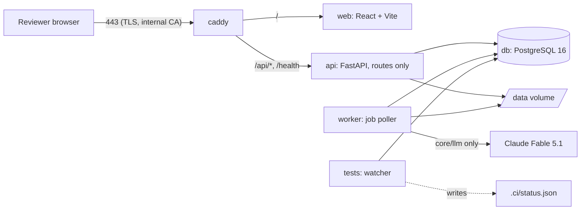

# Architecture

Kept current in the same commit as the code that changes it. Sources of authority: the invariants and locked decisions in `CLAUDE.md`, the inheritance choices in `docs/INHERITANCE.md`, dated decisions in `docs/DECISIONS.md`.

## Components

| Service | Image | Command | Notes |
| --- | --- | --- | --- |
| `db` | `postgres:16` | default | databases `tender` (app) and `tender_ci` (watcher and pytest) |
| `api` | `infra/docker/Dockerfile.python` (target `app`) | `uvicorn api.main:create_app --factory` | routes only; no business logic, no LLM calls |
| `worker` | same image | `python -m worker.main` | idles in Stage 0B; the job chain arrives in Stage 1 |
| `web` | `infra/docker/Dockerfile.web` | Vite dev server | calls `/api/v1/*` through `web/src/api/` only |
| `caddy` | `caddy:2` | `infra/Caddyfile` | TLS with Caddy's internal CA on the static IP |
| `tests` | `infra/docker/Dockerfile.python` (target `tests`: dev dependencies plus Node) | `python infra/ci/run_checks.py --watch` | the continuous test pipeline |

## Repository layout

The layout in `CLAUDE.md` is authoritative. Additions made under operating rule 9 (folder added here first, then the code):

| Folder | Purpose | Added |
| --- | --- | --- |
| `infra/docker/` | `Dockerfile.python` (targets `app` and `tests`) and `Dockerfile.web` | Stage 0B |
| `infra/ci/` | `run_checks.py`, the watcher that writes `.ci/status.json` | Stage 0B |
| `infra/hooks/` | git hooks; `pre-commit` blocks a commit over a red or missing status | Stage 0B |
| `infra/db/` | Postgres init script that creates the `tender_ci` database | Stage 0B |
| `core/config.py`, `core/db.py` | settings and engine/session factories shared by api, worker and scripts | Stage 0B |
| `api/v1/schemas/` | Pydantic I/O models for the routers (named in the layout comment for `api/v1/`) | Stage 0B |
| `web/src/api/openapi.json`, `schema.d.ts` | generated by `make client` from the API; the watcher's `openapi_drift` check fails when they are stale | Stage 0B |
| `migrations/` | Alembic environment and versions (one migration history for core and tender) | Stage 0B |

## Data model

| Table | Purpose | Who writes it | Stage |
| --- | --- | --- | --- |
| `tenant` | one row per tenant; `ergplan` seeded by migration 0001 | migration only | 0B |
| `llm_call_log` | one row per LLM call: prompt name and version, model, input hash, output, tokens, latency, status, request id | `core.llm.client.LLMClient.call` only | 0B |

Every table carries `tenant_id`, `created_at`, `created_by` through `core.models.base.TenantAuditMixin`. The truth tables (document, page, section, extraction_run, candidate, evidence_span, validation_result, approval, canonical_fact, feedback, audit_log, job) arrive in Stage 1 with migration 0002.

## Truth pipeline

| Step | Function | Status |
| --- | --- | --- |
| parse | `core.services.parse` | Stage 1 |
| section map | `core.services.section_map` | Stage 1 |
| extract → `candidate` + `evidence_span` | `core.services.extract` | Stage 1 |
| validate (deterministic) | `core.services.validate` | Stage 1 |
| approve → `canonical_fact` (only writer) | `core.services.approve` | Stage 1 |
| feedback (stored, never auto-applied) | written by `approve` | Stage 1 |

In Stage 0B only the LLM boundary exists: `core.llm.client.LLMClient.call(LLMRequest) -> LLMResponse`, which loads a registered prompt version through `core.llm.registry.load_prompt`, calls the model with a Pydantic output schema, and writes `llm_call_log` for every outcome including failures. Nothing else in the codebase may call the Anthropic SDK.

## API surface

| Router | Routes | Stage |
| --- | --- | --- |
| `api/v1/core/health.py` | `GET /health`, `GET /api/v1/health` | 0B |

Tenant resolution is the request dependency `api.deps.get_tenant_id`, which returns the configured single tenant in phase 1. Errors go through `api/middleware/errors.py`: a request id on every response and a typed error payload.

## Tender documents and roles (decided 2026-10-04, built in Stage 2)

A `tender_version` owns many documents through a link table, each with a role. This refines the Stage 2 prompt, which gave `tender_version` a single `document_id`.

| Table | Columns | Notes |
| --- | --- | --- |
| `tender_version` | tender_id, version_no, kind (original/corrigendum/amendment/clarification), issued_on, summary_of_change, supersedes_version_id | no `document_id` column |
| `tender_version_document` | tender_version_id, document_id, role | role is one of `rfs`, `amendment`, `clarification`, `ppa`, `psa`, `cfda`, `technical`, `contractual`, `nit` |

- The original version of a SECI tender typically holds the RfS plus its standard PPA and PSA (or CfDA). An EPC tender holds a contractual and a technical document. A corrigendum, amendment or clarification still creates a new version with its own document; it is never attached to an existing version.
- Extraction routes each field group to documents by role. Commercial-section fields (payment security, change in law, termination compensation) may be routed to the `ppa` document.
- Nothing changes in the evidence model: an `evidence_span` already names a document id, so a canonical fact shows which document, page and box it came from.
- The roles are the same vocabulary used in `/work/tenders/<type>/<slug>/manifest.yaml`.

## Independent review (operating rule 15, from Stage 1)

Before each stage report, a reviewer from a different model family (OpenAI through `OPENAI_API_KEY`) runs in a fresh context. It receives only the stage diff (`git diff stage-N-start..HEAD`), `CLAUDE.md` and the stage prompt, and answers a fixed five-point checklist. Every finding is fixed and the reviewer is rerun until it reports none; findings and fixes go into the stage report under "Independent review". Stage starts are tagged `stage-N-start`.

## Job chain

None yet. Stage 1 adds the `job` table and the parse → section map → extract → validate chain in `worker/`.

## Continuous test pipeline

`infra/ci/run_checks.py` runs inside the `tests` service, started by `make up`. On every save under the source folders, and again if anything is saved while a run is in progress, it re-runs: `ruff check`, `ruff format --check`, `mypy` on `core tender api worker`, `alembic upgrade head` then `alembic check` against `tender_ci`, `pytest` scoped to the changed package and then the full suite, `openapi` drift between the API and `web/src/api/schema.d.ts`, `tsc --noEmit` and `vitest run` for `web/`. Each run writes `.ci/status.json` (name, pass/fail, duration, first failing message per check) and `.ci/latest.log`. `infra/hooks/pre-commit` refuses a commit when any entry is red or the status is older than the newest staged source file. Tests marked `slow` call the real LLM and run only on `make test-e2e`.

## Deployment

One GCE VM (`instance-20261004-081207`, asia-south2-b), static IP `34.131.65.108` (`infra/STATIC-IP.txt`). `make deploy` pulls, builds, migrates, restarts and health-checks `https://34.131.65.108/health`. Firewall rules are recreated from `infra/allowlist.yaml` by `infra/firewall.sh`. Data lives on the `/data` host directory mounted into api and worker.

## What changed this stage

**Stage 0B (2026-10-04)**

- File created from the locked decisions and layout.
- Decisions recorded for later stages: tender documents with roles; independent review under operating rule 15.
- Compose stack, Python and web scaffolds, Alembic migration 0001 (`tenant`, `llm_call_log`), health endpoint, LLM client with call log, watcher, pre-commit hook, CI workflow.
