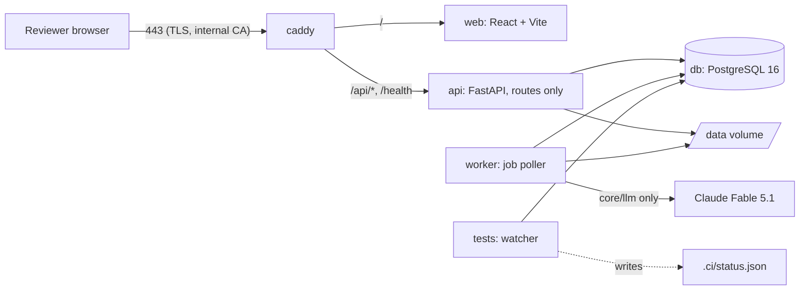

# Architecture

Kept current in the same commit as the code that changes it. Sources of authority: the invariants and locked decisions in `CLAUDE.md`, the inheritance choices in `docs/INHERITANCE.md`, dated decisions in `docs/DECISIONS.md`.

## Components

| Service | Image | Command | Notes |
| --- | --- | --- | --- |
| `db` | `postgres:16` | default | databases `tender` (app) and `tender_ci` (watcher and pytest) |
| `api` | `infra/docker/Dockerfile.python` (target `app`) | `uvicorn api.main:create_app --factory` | routes only; no business logic, no LLM calls |
| `worker` | same image | `python -m worker.main` | one process; polls `job` every 2 s and runs the parse → section map → extract → validate chain |
| `web` | `infra/docker/Dockerfile.web` | Vite dev server | calls `/api/v1/*` through `web/src/api/` only |
| `caddy` | `caddy:2` | `infra/Caddyfile` | TLS with Caddy's internal CA on the static IP |
| `tests` | `infra/docker/Dockerfile.python` (target `tests`: dev dependencies plus Node) | `python infra/ci/run_checks.py --watch` | the continuous test pipeline |

## Repository layout

The layout in `CLAUDE.md` is authoritative. Additions made under operating rule 9 (folder added here first, then the code):

| Folder | Purpose | Added |
| --- | --- | --- |
| `infra/docker/` | `Dockerfile.python` (targets `app` and `tests`) and `Dockerfile.web` | Stage 0B |
| `infra/ci/` | `run_checks.py`, the watcher that writes `.ci/status.json` | Stage 0B |
| `infra/hooks/` | git hooks; `pre-commit` blocks a commit over a red or missing status | Stage 0B |
| `infra/db/` | Postgres init script that creates the `tender_ci` database | Stage 0B |
| `core/config.py`, `core/db.py` | settings and engine/session factories shared by api, worker and scripts | Stage 0B |
| `api/v1/schemas/` | Pydantic I/O models for the routers (named in the layout comment for `api/v1/`) | Stage 0B |
| `core/schemas/` | the extraction schema model (`FieldDef`, `FieldGroup`, `ExtractionSchema`), value types and the `SchemaRegistry`; a schema is data handed to core, which knows nothing about tenders | Stage 1 |
| `web/src/api/openapi.json`, `schema.d.ts` | generated by `make client` from the API; the watcher's `openapi_drift` check fails when they are stale | Stage 0B |
| `migrations/` | Alembic environment and versions (one migration history for core and tender) | Stage 0B |
| `tender/domain_packs/<pack>/` | a domain pack: YAML schemas, prompts under `prompts/<name>/vN.md`, validators (`validation.py` in the core pack, `validation/` in a sector pack) and, for a sector pack, its own `tests/` (collected by pytest through `testpaths`) | Stage 2 |
| `tender/domain_packs/core/value_types.py` | value types the tender schemas add to core's (`money_inr`, `percent`, `duration_months`, `mw`, `mwh`, `kv`, `km`, `record_list`) | Stage 2 |
| `tender/services/` | `packs.py` (YAML → compiled types, registered with core), `tenders.py`, `versioning.py`, `current_view.py`, `field_defs.py`, `extraction_summary.py` | Stage 2 |
| `api/v1/tenders/` | the tender router | Stage 2 |
| `tests/scripts/` | tests of the management commands in `scripts/` | Stage 2 |

## Data model

| Table | Purpose | Who writes it | Stage |
| --- | --- | --- | --- |
| `tenant` | one row per tenant; `ergplan` seeded by migration 0001 | migration only | 0B |
| `llm_call_log` | one row per LLM call: prompt name and version, model, input hash, output, tokens, latency, status, request id, `extraction_run_id` (added in 0002) | `core.llm.client.LLMClient.call` only | 0B, 1 |
| `document` | an uploaded PDF: sha256 (unique per tenant), filename, mime, page_count, storage_path, status `uploaded/parsed/failed`, error | `IngestService.upload`; status and page_count by `ParseService.parse` | 1 |
| `page` | per page: text, width and height in PDF points, `render_path` (PNG at 150 dpi), `char_boxes` (one `[x0, top, x1, bottom]` per character of `text`, null for layout whitespace), `has_text_layer` | `ParseService.parse` | 1 |
| `section` | contiguous page range with heading, free-text `kind`, confidence, prompt version | `SectionMapper.map` | 1 |
| `extraction_run` | one extraction of one document with one schema and prompt version, for one object (`object_type`, `object_id`, `object_version`); status `queued/running/extracted/validated/failed`, tokens, cost | `ExtractService.start_run` and `.extract`; `ValidationService.validate` sets `validated` | 1 |
| `candidate` | model output for one field: value (jsonb), value_type, confidence, rationale, status `raw/validated/needs_review/superseded/not_found/rejected`, prompt name and version, the call log row, the page window | inserted by `ExtractService` only; **immutable** except `status` (trigger `candidate_immutable`) | 1 |
| `evidence_span` | where the value is written: document, page, bbox, char range, quote, how it was located (`stated_page/adjacent_page/window_page/unresolved`), match score | inserted by `ExtractService` only; **append-only** (trigger) | 1 |
| `validation_result` | one row per rule per candidate: rule name, passed, message | `ValidationService.validate` | 1 |
| `approval` | a reviewer's decision `approved/edited/not_in_document/rejected` with final value, reviewer, note; `active` or `superseded` | `ApprovalService.approve` only | 1 |
| `canonical_fact` | truth: object, version, field, value, value_type, approval, evidence copied from the candidate (plus the reviewer's decision when it was not a plain approval), `is_current` | **`ApprovalService.approve` only**. Trigger `canonical_fact_guard` (migration 0004): a row is accepted only under a live approval (active, not a rejection) of the same tenant, object, version and field; afterwards it can be retired (`is_current`, `superseded_at`) once its approval is superseded, and never changed or deleted | 1 |
| `feedback` | candidate value, final value, `delta_kind` (`format/wrong_value/missing/extra`), reviewer, prompt version | `ApprovalService.approve` only; nothing reads it at runtime | 1 |
| `audit_log` | actor, action, table, row id, before, after, at | `core.services.audit.record`, called by extract, validate and approve; **append-only** (trigger) | 1 |
| `job` | kind, payload, status `queued/running/done/failed`, attempts, max_attempts, last_error, run_after | `core.services.jobs` | 1 |
| `tender` | tender_type, issuing_agency, external_ref, title, slug (folder name for tenders ingested by the command), status `ingested/extracted/in_review/reviewed/published`, current_version_id | `tender.services.tenders.TenderService` | 2 |
| `tender_version` | tender_id, version_no, kind `original/corrigendum/amendment/clarification`, issued_on, summary_of_change, supersedes_version_id. Never edited: a change to a tender is a new row | `TenderService.add_version`; audited | 2 |
| `tender_version_document` | tender_version_id, document_id, role (`rfs`, `amendment`, `clarification`, `ppa`, `psa`, `cfda`, `technical`, `contractual`, `nit`) | `TenderService.add_version` and `attach_document`; audited on the version | 2 |
| `tender_field_def` | the compiled schemas, one row per tender type and field: path, namespace (`core` or `sector`), domain, subdomain, section, label, value_type, required, help_text, review_order | `tender.services.field_defs.sync_field_defs` when the API starts; replaced only when the packs changed | 2 |

Every table carries `tenant_id`, `created_at`, `created_by` through `core.models.base.TenantAuditMixin`; a test fails if a table is added without them.

Invariants the database itself enforces (migration 0002): a `candidate` row can be neither deleted nor updated in any column but `status`; `evidence_span` and `audit_log` rows can be neither updated nor deleted. Tests in `tests/core/test_invariants.py` try each and expect the refusal.

A candidate, approval and canonical fact belong to an **object** (`object_type`, `object_id`, `object_version`). In Stage 1 the object is the document itself (`object_type = "document"`, version 1). Stage 2 passes `tender` and the tender version number, which is how a canonical fact becomes attached to a tender version without core knowing what a tender is.

## Truth pipeline

| Step | Function | Writes |
| --- | --- | --- |
| upload | `core.services.ingest.IngestService.upload` | `document`, file in storage, `job(parse)`. Same sha256 returns the existing document |
| parse | `core.services.parse.ParseService.parse` | `page` rows (pdfplumber text and character boxes, pymupdf render), `document.status = parsed`, `job(section_map)` |
| section map | `core.services.section_map.SectionMapper.map` | `section` rows from one model call over a digest of every page (first 400 characters plus heading-like lines) |
| start run | `core.services.extract.ExtractService.start_run` | `extraction_run`, `job(extract)`. Refuses an unknown schema or an unregistered prompt version |
| extract | `core.services.extract.ExtractService.extract` | per field group: pages chosen by `select_pages` from the group's routing hints (the sections whose kind or heading the hints name, plus up to 12 pages outside them that mention the group's keywords, taken keyword by keyword so a frequent keyword cannot crowd out a rare one), sent as a native PDF of at most 40 pages per call; output model built by `build_group_model` requires value, confidence, rationale and evidence for every field. Inserts `candidate` and `evidence_span`, then `job(validate)` |
| locate evidence | `core.services.evidence.locate`, driven by `ExtractService._resolve` | each quote is matched on the stated page, then the adjacent pages, then the rest of the window. Four matchers in order (the fourth, added in Stage 2, finds the quote's words in order with other words between them, for a column of a two-column table; at least 90% of the words and every number must be found): exact after normalisation, on word boundaries only ("50 MW" is not found inside "250 MW"); rapidfuzz at threshold 85, for quotes of 12 characters or more; and, for quotes that hold a number, the quote's words in any order over consecutive page words with every number unchanged (wrapped table cells). Unlocated: the span is stored as `unresolved` and the candidate's confidence is capped at 0.3 |
| validate (deterministic) | `core.services.validate.ValidationService.validate` | `validation_result` rows: `evidence_located` or `evidence_not_located` (also when only some of a candidate's quotes were found), `type`, `range`, `regex`, `required_present`, and the schema's cross-field rules, written on every typed candidate of the fields a rule concerns. Sets `candidate.status` to `validated` or `needs_review`. No model call |
| read model | `core.services.review_state.ReviewStateService.for_object` | nothing; returns every schema field with its best live candidate, evidence, validation results and active approval, for one version of the object (the latest by default). A version may be extracted by several runs, one per document; the state reads the live candidates of all of them (`runs` lists them) and a field may have candidates from more than one document. A run that is queued, running or failed hides nothing |
| approve → `canonical_fact` (only writer) | `core.services.approve.ApprovalService.approve` | `approval`, `canonical_fact` (for approved, edited, not_in_document), `feedback` when the final value differs (`classify_delta`), `audit_log`. A later decision supersedes the earlier approval and its fact. An identical repeat writes nothing. A plain approval requires that the candidate's evidence was located. An edit of a field that has no located evidence must bring the reviewer's own evidence (page and quote), which is located on the page and stored on the fact as a `reviewer_span`; otherwise it is refused. Unique indexes (migration 0003) allow one active approval and one current fact per field of an object version |

Candidate outcomes that never reach a reviewer as a value: `not_found` (the model returned null; shown as "no value"; it becomes `needs_review` with `required_present` failed when the field is required; it can be decided as not_in_document, or as edited when the reviewer supplies located evidence) and `rejected` (a value came with no quote; stored for the record, never shown, cannot be approved).

A schema is data handed to core: `core.schemas.ExtractionSchema` (field groups with routing hints, fields with value type, unit, range and regex) registered in a `SchemaRegistry` together with any cross-field rules. Core names no tender field. In Stage 1 the deployed API and worker start with an empty registry; the tender schemas are registered in Stage 2. Tests register a small contract schema and, for the end-to-end run, a 12-field FDRE schema (`tests/fixtures/`).

The LLM boundary is unchanged from Stage 0B: `core.llm.client.LLMClient.call(LLMRequest) -> LLMResponse` loads a registered prompt version through `core.llm.registry.load_prompt`, calls the model with a Pydantic output schema, and writes `llm_call_log` for every outcome including failures. Nothing else in the codebase may call the Anthropic SDK. Prompts: `core/llm/prompts/section_map/v1.md`, `core/llm/prompts/extract/v1.md`.

## API surface

| Router | Routes | Stage |
| --- | --- | --- |
| `api/v1/core/health.py` | `GET /health`, `GET /api/v1/health` | 0B |
| `api/v1/core/documents.py` | `POST /api/v1/documents` (multipart), `GET /api/v1/documents/{id}`, `GET /api/v1/documents/{id}/pages/{n}/render`, `GET /api/v1/documents/{id}/sections` | 1 |
| `api/v1/core/extraction.py` | `POST /api/v1/documents/{id}/extract`, `GET /api/v1/extraction-runs/{id}` | 1 |
| `api/v1/core/review.py` | `GET /api/v1/review-state`, `POST /api/v1/approvals`, `GET /api/v1/canonical` | 1 |
| `api/v1/tenders/tenders.py` | `POST /api/v1/tenders`, `GET /api/v1/tenders`, `GET /api/v1/tenders/{id}`, `POST /api/v1/tenders/{id}/versions` (multipart: file, kind, issued_on, role, summary_of_change; with version_no the document joins an existing version), `GET /api/v1/tenders/{id}/versions`, `GET /api/v1/tenders/{id}/view`, `POST /api/v1/tenders/{id}/extract`, `GET /api/v1/tenders/{id}/review-state` (core's review state for one version, plus the fields that version changes), `GET /api/v1/schemas/tender/{type}`, `GET /api/v1/reports/extraction-summary` | 2 |

Tenant resolution is the request dependency `api.deps.get_tenant_id`, which returns the configured single tenant in phase 1. Errors go through `api/middleware/errors.py`: a request id on every response and a typed error payload. The reviewer of an approval comes from the `X-Reviewer` header in phase 1 (`api.deps.get_reviewer`); the Stage 3 token middleware will set it. The API never calls the model: it queues jobs and reads state.

## Tender domain layer (Stage 2)

`tender/` sits on top of `core/` and core does not import it (a test enforces this). What the tender layer adds is data (schemas, prompts), deterministic rules, and the tender, version and document tables.

**Domain packs.** `tender/domain_packs/core/common.yaml` holds the fields every tender has (`core.<section>.<field>`); `tender/domain_packs/power/pack.yaml` holds the power fields every power tender shares (`sector.power.common.<field>`); one YAML per tender type holds its own (`sector.power.<type>.<field>`) and lists the common sections it includes. `tender.services.packs.load_catalog` compiles each type into a core `ExtractionSchema` named `tender.<type>` `v1`, once, at start-up, and `Catalog.register` hands the schemas, the tender value types, the cross-field rules and the run rules to core's `SchemaRegistry`. A type resolves to one pack. A combined type is its own YAML with `inherits: [a, b]`, folded in at compile time; two different definitions of one field or section are an error. A malformed file (unknown key, unknown section or role, a path outside the pack's namespace) is refused.

**Sections.** A section is what the reviewer sees as one block and what the extractor reads in one call: summary, identity_and_scope, key_dates, eligibility, guarantees, commercial, penalties, connectivity_and_compliance, documents, then one type section (solar_tech, wind_tech, hybrid_mix, fdre_profile, bess_performance, tbcb_elements, gen_tech, epc_scope, ipp_model_inputs). Each has a prompt (`summary` or `extract/<section>`), the document roles it is read from, and routing hints. Every section prompt has the header `extends: extract/v1`: its text is core's extract prompt followed by the domain guidance, and its hash covers both.

**Versions and documents.** The original documents of a tender are version 1; each corrigendum, amendment or clarification is a new version (`TenderService.add_version`). Further documents of a version (PPA, PSA, technical volume) are attached with `attach_document`. Candidates, approvals and canonical facts of a tender carry `object_type = "tender"`, `object_id = tender.id`, `object_version = version_no`.

**Extraction of a version** (`TenderService.start_extraction`, planned by `tender.services.versioning.plan_groups`): one core extraction run per document, limited to the groups that document is read for. Version 1: the groups whose roles include the document's role (an RfS is read for every section; a PPA or CfDA for commercial and penalties; a technical volume for the type section). A later version: only the groups whose routing keywords occur in the document's text, never the summary. Fields a later version does not mention get no candidate in that version and keep the earlier canonical facts.

**Current view** (`tender.services.current_view.current_view`): per field, the current canonical fact of the latest version that states a value, with that version's number and kind. A later version that has no value for a field, or whose reviewer marked it not in document, leaves the earlier fact in place. Canonical facts only, never candidates.

**Rules** (plain Python, no model): `date_order`, `emd_pbg_within_10x` (core pack); `bid_capacity_order`, `elements_have_kv` (power pack); ranges in the YAML (tariff ceiling 1 to 15 INR/kWh, PPA tenure 10 to 35 years, SCOD at least 1 month); type rules as required fields (fdre: demand profile and availability shortfall penalty; bess: MWh and cycles per day; transmission: elements; hybrid: minimum share per resource); and the corrigendum rule `later_version_evidence`, a run rule: a value produced for a later version must carry evidence from a document of that version.

**Formulas and deferred dates.** EMD and PBG have a per-MW field and a formula field (`core.guarantees.emd_formula`, `pbg_formula`), each with its own evidence; the per-MW field is filled only where the tender states one figure. Dates the document defers to the NIT or a later notice stay null, and `core.key_dates.dates_deferred_note` records which dates are deferred and to which document, with the deferral quoted.

**Core extension points added for this stage** (each with a test, each in DECISIONS.md): a run may be limited to named groups (`extraction_run.groups`); candidates are superseded per field and per document, so the documents of one version do not supersede each other; review state reads across the runs of a version; run rules (`SchemaRegistry.register_run_rule`); prompt inheritance (`extends`); `FieldDef.item_keys` for record lists.

**Intended path, not built:** a second sector pack; automatic sector classification at ingestion; composition of several packs over one tender; packs as separately licensed products. The second sector is added when power is at measured reliability and a customer is attached to it, as a test of whether `core/` truly generalises. The financial model will take a model type, `model_tender(tender_id, model_type)`, with `power_project_finance` the only implementation; `epc_contract_cashflow`, `supply_contract_margin` and `o&m_contract_economics` are future work.

### Tender documents and roles (decided 2026-10-04)

A `tender_version` owns many documents through a link table, each with a role. This refines the Stage 2 prompt, which gave `tender_version` a single `document_id`.

| Table | Columns | Notes |
| --- | --- | --- |
| `tender_version` | tender_id, version_no, kind (original/corrigendum/amendment/clarification), issued_on, summary_of_change, supersedes_version_id | no `document_id` column |
| `tender_version_document` | tender_version_id, document_id, role | role is one of `rfs`, `amendment`, `clarification`, `ppa`, `psa`, `cfda`, `technical`, `contractual`, `nit` |

- The original version of a SECI tender typically holds the RfS plus its standard PPA and PSA (or CfDA). An EPC tender holds a contractual and a technical document. A corrigendum, amendment or clarification still creates a new version with its own document; it is never attached to an existing version.
- Extraction routes each field group to documents by role. Commercial-section fields (payment security, change in law, termination compensation) may be routed to the `ppa` document.
- Nothing changes in the evidence model: an `evidence_span` already names a document id, so a canonical fact shows which document, page and box it came from.
- The roles are the same vocabulary used in `/work/tenders/<type>/<slug>/manifest.yaml`.

## Independent review (operating rule 15, from Stage 1)

Before each stage report, a reviewer from a different model family (OpenAI through `OPENAI_API_KEY`) runs in a fresh context. It receives only the stage diff (`git diff stage-N-start..HEAD`), `CLAUDE.md` and the stage prompt, and answers a fixed five-point checklist. Code defects are fixed and the reviewer is rerun until it reports no new code defect; findings that code cannot resolve are listed in the stage report with a one-line rationale and do not block the stage (rule 15 as amended on 2026-10-04). Stage starts are tagged `stage-N-start`.

## Job chain

`worker.runner.Runner` claims one due job at a time (`core.services.jobs.claim_next`, `FOR UPDATE SKIP LOCKED`) and runs its handler. Each step enqueues the next:

`upload` → `parse` → `section_map`, and `start_run` → `extract` → `validate`. Extraction of a tender version is started explicitly (`POST /tenders/{id}/extract` or `python -m scripts.ingest_tenders extract`) once its documents are parsed; it queues one `extract` job per document.

A failure is stored with its traceback in `job.last_error`. A retryable failure is retried three times with backoff (30 s, 60 s, 120 s; `max_attempts` is 4); a non-retryable one (unknown document, schema or prompt; a refusal, truncation or invalid output from the model) fails at once. When an extract or validate job fails for good, the run is marked `failed` with the error. Extraction commits per field group, so a retry resumes at the first group without candidates. When the worker starts, jobs still marked `running` were left by a worker that died and are put back in the queue (`jobs.requeue_orphans`). The newest finished run of an object keeps the live candidates: a run supersedes the candidates of runs started before it, and supersedes its own if a run started later has already finished. A section map that fails for good is shown in `document.error`. A worker serves one tenant (`TENANT_ID`): it claims, completes, fails and re-queues only that tenant's jobs.

## Continuous test pipeline

`infra/ci/run_checks.py` runs inside the `tests` service, started by `make up`. On every save under the source folders, and again if anything is saved while a run is in progress, it re-runs: `ruff check`, `ruff format --check`, `mypy` on `core tender api worker`, `alembic upgrade head` then `alembic check` against `tender_ci`, `pytest` scoped to the changed package and then the full suite, `openapi` drift between the API and `web/src/api/schema.d.ts`, `tsc --noEmit` and `vitest run` for `web/`. Each run writes `.ci/status.json` (name, pass/fail, duration, first failing message per check) and `.ci/latest.log`. `infra/hooks/pre-commit` refuses a commit when any entry is red or the status is older than the newest staged source file. Tests marked `slow` call the real LLM and run only on `make test-e2e`.

## Deployment

One GCE VM (`instance-20261004-081207`, asia-south2-b), static IP `34.131.65.108` (`infra/STATIC-IP.txt`). `make deploy` pulls, builds, migrates, restarts and health-checks `https://34.131.65.108/health`. Firewall rules are recreated from `infra/allowlist.yaml` by `infra/firewall.sh`. Data lives on the `/data` host directory mounted into api and worker.

## What changed this stage

**Stage 0B (2026-10-04)**

- File created from the locked decisions and layout.
- Decisions recorded for later stages: tender documents with roles; independent review under operating rule 15.
- Compose stack, Python and web scaffolds, Alembic migration 0001 (`tenant`, `llm_call_log`), health endpoint, LLM client with call log, watcher, pre-commit hook, CI workflow.

**Stage 1 (2026-10-04)**

- Migration 0004 (after the stage was accepted): database guard on `canonical_fact`, see the data model table. The tender tables of Stage 2 therefore start at 0005.
- Validation messages name the reason a candidate has no located evidence: "evidence not located on p.N" and "required field: the model returned no value".
- Migration 0003: unique indexes for one active approval and one current canonical fact per field.
- Migration 0002: document, page, section, extraction_run, candidate, evidence_span, validation_result, approval, canonical_fact, feedback, audit_log, job; `llm_call_log.extraction_run_id`; three database triggers for immutability.
- `core/services/`: ingest, parse, section_map, extract, evidence, validate, approve, review_state, audit, jobs. `core/schemas/`, `core/storage/`, `core/validation/`.
- Prompts `section_map/v1` and `extract/v1`.
- API routers documents, extraction, review under `/api/v1/`; generated client refreshed.
- Worker job chain with retries.
- End-to-end test on two FDRE tenders, the SECI FDRE-IX RfS and the NHPC FDRE-II RfS, with a 12-field test schema (`tests/e2e/test_fdre_core_pipeline.py`).

**Stage 2 (2026-10-04)**

- Migration 0005: `tender`, `tender_version`, `tender_version_document`, `tender_field_def`; `extraction_run.groups`.
- Domain packs `core` and `power`: nine tender types, 80 to 89 fields each, 18 section prompts, tender value types, validators.
- `tender/services/`: packs, tenders, versioning, current_view, field_defs, extraction_summary.
- Tender router under `/api/v1/`; the API and the worker register the tender schemas at start-up; generated client refreshed.
- Core extension points: group-limited runs, per-field and per-document supersession, review state across the runs of a version, run rules, prompt inheritance, `item_keys`.
- `scripts/ingest_tenders.py`: ingest, extract, resume, wait, summary.
- Evidence location: a fourth matcher for a quote read down one column of a two-column table.
