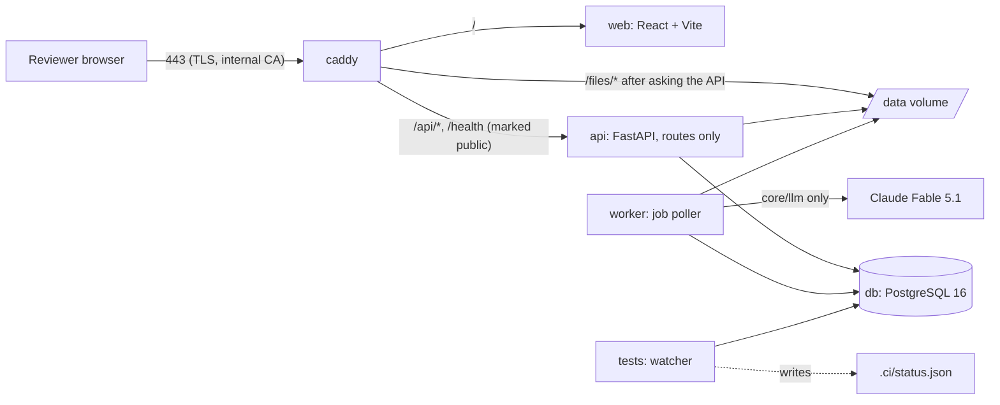

# Architecture

Kept current in the same commit as the code that changes it. Sources of authority: the invariants and locked decisions in `CLAUDE.md`, the inheritance choices in `docs/INHERITANCE.md`, dated decisions in `docs/DECISIONS.md`.

## Components



| Service | Image | Command | Notes |
| --- | --- | --- | --- |
| `db` | `postgres:16` | default | databases `tender` (app) and `tender_ci` (watcher and pytest) |
| `api` | `infra/docker/Dockerfile.python` (target `app`) | `uvicorn api.main:create_app --factory` | routes only; no business logic, no LLM calls |
| `worker` | same image | `python -m worker.main` | one process; polls `job` every 2 s and runs the parse → section map → extract → validate chain |
| `web` | `infra/docker/Dockerfile.web` | Vite dev server | the reviewer screen; calls `/api/v1/*` through `web/src/api/` only |
| `caddy` | `caddy:2` | `infra/Caddyfile` (routes in `infra/Caddyfile.routes`) | TLS with Caddy's internal CA on the static IP; marks API requests as public; serves stored files from `/data` (read-only mount) after `forward_auth` to the API |
| `api-e2e`, `caddy-e2e`, `playwright` | tests image, `caddy:2`, `mcr.microsoft.com/playwright` | compose profile `e2e`, started only by `make test-ui` | the browser tests: an API on database `tender_e2e` seeded by `tests/e2e/seed_review.py` with a scripted model, the same proxy routes over HTTP, and Playwright |
| `tests` | `infra/docker/Dockerfile.python` (target `tests`: dev dependencies plus Node) | `python infra/ci/run_checks.py --watch` | the continuous test pipeline |

## Repository layout

The layout in `CLAUDE.md` is authoritative. Additions made under operating rule 9 (folder added here first, then the code):

| Folder | Purpose | Added |
| --- | --- | --- |
| `infra/docker/` | `Dockerfile.python` (targets `app` and `tests`) and `Dockerfile.web` | Stage 0B |
| `infra/ci/` | `run_checks.py`, the watcher that writes `.ci/status.json` | Stage 0B |
| `infra/hooks/` | git hooks; `pre-commit` blocks a commit over a red or missing status | Stage 0B |
| `infra/db/` | Postgres init script that creates the `tender_ci` database | Stage 0B |
| `core/config.py`, `core/db.py` | settings and engine/session factories shared by api, worker and scripts | Stage 0B |
| `api/v1/schemas/` | Pydantic I/O models for the routers (named in the layout comment for `api/v1/`) | Stage 0B |
| `core/schemas/` | the extraction schema model (`FieldDef`, `FieldGroup`, `ExtractionSchema`), value types and the `SchemaRegistry`; a schema is data handed to core, which knows nothing about tenders | Stage 1 |
| `tender/domain_packs/<pack>/released/` | one file per released schema version (`v1.yaml`, `v2.yaml`): per tender type, every field with its type, unit, allowed values and record keys; written by `scripts/release_schema.py`, never by hand; the pack loader compares versions against them | Stage 3 |
| `web/src/api/openapi.json`, `schema.d.ts` | generated by `make client` from the API; the watcher's `openapi_drift` check fails when they are stale | Stage 0B |
| `migrations/` | Alembic environment and versions (one migration history for core and tender) | Stage 0B |
| `tender/domain_packs/<pack>/` | a domain pack: YAML schemas, prompts under `prompts/<name>/vN.md`, validators (`validation.py` in the core pack, `validation/` in a sector pack) and, for a sector pack, its own `tests/` (collected by pytest through `testpaths`) | Stage 2 |
| `tender/domain_packs/core/value_types.py` | value types the tender schemas add to core's (`money_inr`, `percent`, `duration_months`, `mw`, `mwh`, `kv`, `km`, `record_list`) | Stage 2 |
| `tender/services/` | `packs.py` (YAML → compiled types, registered with core), `tenders.py`, `versioning.py`, `current_view.py`, `field_defs.py`, `extraction_summary.py` | Stage 2 |
| `api/v1/tenders/` | the tender router | Stage 2 |
| `core/evidence/` | the quote resolver (`resolver.py`) and its corpus loader (`corpus.py`); imports nothing from the rest of core | Stage 2 |
| `tests/core/evidence_corpus/` | real and deliberate cases for the resolver, with page text and character boxes | Stage 2 |
| `tests/scripts/` | tests of the management commands in `scripts/` | Stage 2 |
| `core/services/extract_plan.py`, `core/llm/pricing.py` | which field groups share a page window; what a call costs | Stage 3 |
| `tender/models/review.py`, `tender/services/tokens.py`, `tender/services/review.py` | review tokens and snapshots; the reviewer's view of a tender and completing a review | Stage 3 |
| `api/middleware/review_token.py`, `api/middleware/audit.py` | named in the layout; built in Stage 3 | Stage 3 |
| `api/v1/tenders/review.py` | the review router (tokens, session, tender review, completion, snapshot, file authorisation) | Stage 3 |
| `web/src/review/` | `ReviewApp` (the link), `ReviewScreen` (the two panes, keys, saving), `SectionList`, `FieldCard`, `EditForm`, `EvidenceChip`, `PdfPane` with `pdfText` (pdf.js), `SummaryPage`, `MessagePage`, `model.ts` | Stage 3 |
| `web/src/lib/` | `format.ts` (values by type), `keyboard.ts` (the reviewer's keys) | Stage 3 |
| `web/e2e/`, `web/playwright.config.ts` | the Playwright suite, run by `make test-ui` | Stage 3 |
| `tests/e2e/seed_review.py` | seeds the browser-test database | Stage 3 |
| `infra/Caddyfile.routes`, `infra/Caddyfile.e2e` | the proxy routes shared by the deployed site and the browser-test stack | Stage 3 |
| `scripts/review_token.py`, `scripts/gen_field_trace.py` | review links; `docs/FIELD-TRACE.md` | Stage 3 |

## Data model

| Table | Purpose | Who writes it | Stage |
| --- | --- | --- | --- |
| `tenant` | one row per tenant; `ergplan` seeded by migration 0001 | migration only | 0B |
| `llm_call_log` | one row per LLM call: prompt name and version, model, input hash, output, tokens (`tokens_in` is the uncached input; `cache_write_tokens` and `cache_read_tokens` are the rest of it), `mode` (`sync` or `batch`), `batch_id`, `cost_usd` with the cache and batch factors applied, latency, status, request id, `extraction_run_id` | `core.llm.client.LLMClient` only (`call`, and `collect_batch` for calls read from a batch) | 0B, 1, 3 |
| `llm_batch` | a batch handed to the provider's batch API: provider batch id, run, wave (1 writes shared windows to the cache, 2 reads them), status `submitted/collected`, the custom id and input hash of each call | `LLMClient.submit_batch`; status by `collect_batch` | 3 |
| `document` | an uploaded PDF: sha256 (unique per tenant), filename, mime, page_count, storage_path, status `uploaded/parsed/failed`, error | `IngestService.upload`; status and page_count by `ParseService.parse` | 1 |
| `page` | per page: text, width and height in PDF points, `render_path` (PNG at 150 dpi), `char_boxes` (one `[x0, top, x1, bottom]` per character of `text`, null for layout whitespace), `has_text_layer` | `ParseService.parse` | 1 |
| `section` | contiguous page range with heading, free-text `kind`, confidence, prompt version | `SectionMapper.map` | 1 |
| `extraction_run` | one extraction of one document with one schema and prompt version, for one object (`object_type`, `object_id`, `object_version`); status `queued/running/extracted/validated/failed`, `mode` (`sync`, `batch`, or `record` for a run whose candidate was written from the object's record and read no page), tokens (`token_in` is the whole input, `token_cached` the part read from the prompt cache), cost | `ExtractService.start_run` and `.extract`; `ValidationService.validate` sets `validated` | 1 |
| `candidate` | model output for one field: value (jsonb), value_type, confidence, rationale, status `raw/validated/needs_review/superseded/not_found/rejected`, prompt name and version, the call log row, the page window | inserted by `ExtractService` only (`extract`, and `record_candidate` for a candidate written from the record); **immutable** except `status` (trigger `candidate_immutable`) | 1, 3 |
| `evidence_span` | where the value is written: document, page, bbox, char range, quote, how it was located (`stated_page/adjacent_page/window_page/unresolved`), match score | inserted by `ExtractService` only; **append-only** (trigger) | 1 |
| `validation_result` | one row per rule per candidate: rule name, passed, message | `ValidationService.validate` | 1 |
| `approval` | a reviewer's decision `approved/edited/not_in_document/rejected/flagged` with final value, reviewer, note; `active` or `superseded`. A flag ("unsure, come back") keeps the note, withdraws an earlier decision and decides nothing | `ApprovalService.approve` only | 1, 3 |
| `canonical_fact` | truth: object, version, field, value, value_type, approval, evidence copied from the candidate (plus the reviewer's decision when it was not a plain approval), `is_current` | **`ApprovalService.approve` only**. Trigger `canonical_fact_guard` (migration 0004): a row is accepted only under a live approval (active, and one of approved, edited, not_in_document since migration 0008) of the same tenant, object, version and field; afterwards it can be retired (`is_current`, `superseded_at`) once its approval is superseded, and never changed or deleted | 1 |
| `feedback` | candidate value, final value, `delta_kind` (`format/wrong_value/missing/extra`), reviewer, prompt version | `ApprovalService.approve` only; nothing reads it at runtime | 1 |
| `audit_log` | actor, action, table, row id, before, after, at | `core.services.audit.record`, called by extract, validate and approve; **append-only** (trigger) | 1 |
| `job` | kind, payload, status `queued/running/done/failed`, attempts, max_attempts, last_error, run_after | `core.services.jobs` | 1 |
| `tender` | tender_type, issuing_agency, external_ref, title, slug (folder name for tenders ingested by the command), status `ingested/extracted/in_review/reviewed/published`, current_version_id | `tender.services.tenders.TenderService` | 2 |
| `tender_version` | tender_id, version_no, kind `original/corrigendum/amendment/clarification`, issued_on, summary_of_change, supersedes_version_id. Never edited: a change to a tender is a new row | `TenderService.add_version`; audited | 2 |
| `tender_version_document` | tender_version_id, document_id, role (`rfs`, `amendment`, `clarification`, `ppa`, `psa`, `cfda`, `technical`, `contractual`, `nit`) | `TenderService.add_version` and `attach_document`; audited on the version | 2 |
| `review_token` | the link a reviewer opens: token (32 random url-safe characters, unique), tender_id, reviewer_name, expires_at (30 days), completed_at, revoked_at. One live token per tender | `tender.services.tokens.TokenService.create` (revokes the earlier one; audited); `completed_at` by `tender.services.review.complete_review` | 3 |
| `tender_review_snapshot` | the current view of a tender when its review was completed (jsonb: every field's final value, version and evidence, the reviewer, the flagged fields), for the gold set | `tender.services.review.complete_review`; audited on the tender | 3 |
| `tender_field_def` | the compiled schemas, one row per tender type and field: path, namespace (`core` or `sector`), domain, subdomain, section, label, value_type, required, help_text, review_order | `tender.services.field_defs.sync_field_defs` when the API starts; replaced only when the packs changed | 2 |

Every table carries `tenant_id`, `created_at`, `created_by` through `core.models.base.TenantAuditMixin`; a test fails if a table is added without them.

Invariants the database itself enforces (migration 0002): a `candidate` row can be neither deleted nor updated in any column but `status`; `evidence_span` and `audit_log` rows can be neither updated nor deleted. Tests in `tests/core/test_invariants.py` try each and expect the refusal.

A candidate, approval and canonical fact belong to an **object** (`object_type`, `object_id`, `object_version`). In Stage 1 the object is the document itself (`object_type = "document"`, version 1). Stage 2 passes `tender` and the tender version number, which is how a canonical fact becomes attached to a tender version without core knowing what a tender is.

## Truth pipeline

| Step | Function | Writes |
| --- | --- | --- |
| upload | `core.services.ingest.IngestService.upload` | `document`, file in storage, `job(parse)`. Same sha256 returns the existing document |
| parse | `core.services.parse.ParseService.parse` | `page` rows (pdfplumber text and character boxes, pymupdf render), `document.status = parsed`, `job(section_map)` |
| section map | `core.services.section_map.SectionMapper.map` | `section` rows from one model call over a digest of every page (first 400 characters plus heading-like lines) |
| start run | `core.services.extract.ExtractService.start_run` | `extraction_run`, `job(extract)`. Refuses an unknown schema or an unregistered prompt version |
| extract | `core.services.extract.ExtractService.extract` | per field group: pages chosen by `select_pages` from the group's routing hints (the sections whose kind or heading the hints name, plus up to 12 pages outside them that mention the group's keywords, taken keyword by keyword so a frequent keyword cannot crowd out a rare one), sent as a native PDF of at most 40 pages per call. Groups whose windows overlap enough are read from one shared window, sent as a cached prefix (`core.services.extract_plan.share_windows`, see "Cost of extraction" below); output model built by `build_group_model` requires value, confidence, rationale and evidence for every field. Inserts `candidate` and `evidence_span`, then `job(validate)` |
| locate evidence | `core.evidence.resolve`, driven by `ExtractService._resolve` | each quote is matched on the stated page, then the adjacent pages, then the rest of the window. Four matchers in order (the fourth, added in Stage 2, finds the quote's words in order with other words between them, for a column of a two-column table; at least 90% of the words and every number must be found): exact after normalisation, on word boundaries only ("50 MW" is not found inside "250 MW"); rapidfuzz at threshold 85, for quotes of 12 characters or more; and, for quotes that hold a number, the quote's words in any order over consecutive page words with every number unchanged (wrapped table cells). Unlocated: the span is stored as `unresolved` and the candidate's confidence is capped at 0.3 |
| validate (deterministic) | `core.services.validate.ValidationService.validate` | `validation_result` rows: `evidence_located` or `evidence_not_located` (also when only some of a candidate's quotes were found), `type`, `range`, `regex`, `required_present`, and the schema's cross-field rules, written on every typed candidate of the fields a rule concerns. Sets `candidate.status` to `validated` or `needs_review`. No model call |
| read model | `core.services.review_state.ReviewStateService.for_object` | nothing; returns every schema field with its best live candidate, evidence, validation results and active approval, for one version of the object (the latest by default). A version may be extracted by several runs, one per document; the state reads the live candidates of all of them (`runs` lists them) and a field may have candidates from more than one document. A run that is queued, running or failed hides nothing |
| approve → `canonical_fact` (only writer) | `core.services.approve.ApprovalService.approve` | `approval`, `canonical_fact` (for approved, edited, not_in_document), `feedback` when the final value differs (`classify_delta`), `audit_log`. A later decision supersedes the earlier approval and its fact. An identical repeat writes nothing. A plain approval requires that the candidate's evidence was located. An edit of a field that has no located evidence must bring the reviewer's own evidence (page and quote), which is located on the page and stored on the fact as a `reviewer_span`; otherwise it is refused. Unique indexes (migration 0003) allow one active approval and one current fact per field of an object version |

Candidate outcomes that never reach a reviewer as a value: `not_found` (the model returned null; shown as "no value"; it becomes `needs_review` with `required_present` failed when the field is required; it can be decided as not_in_document, or as edited when the reviewer supplies located evidence) and `rejected` (a value came with no quote; stored for the record, never shown, cannot be approved).

A schema is data handed to core: `core.schemas.ExtractionSchema` (field groups with routing hints, fields with value type, unit, range and regex) registered in a `SchemaRegistry` together with any cross-field rules. Core names no tender field. In Stage 1 the deployed API and worker start with an empty registry; the tender schemas are registered in Stage 2. Tests register a small contract schema and, for the end-to-end run, a 12-field FDRE schema (`tests/fixtures/`).

The LLM boundary is `core/llm/`: `core.llm.client.LLMClient.call(LLMRequest) -> LLMResponse` loads a registered prompt version through `core.llm.registry.load_prompt`, calls the model with a Pydantic output schema, and writes `llm_call_log` for every outcome including failures. Nothing else in the codebase may call the Anthropic SDK. Prompts: `core/llm/prompts/section_map/v1.md`, `core/llm/prompts/extract/v1.md`.

### Cost of extraction (Stage 3)

Native PDF pages cost about 2,800 input tokens each, and in Stage 2 every field group sent its own pages. Two things reduce that, both inside `core/llm/` and `core/services/extract.py`:

- **Shared windows as a cached prefix.** `share_windows` takes each group's window and merges windows step by step, always the two whose union makes their groups read the fewest extra pages, and keeps the cheapest partition it passes. The cost of a window is counted in uncached pages: one group pays every page in full; several pay one cache write (1.25 times the input price, 2 times for the one-hour cache of a batch run) and a cache read (0.025 times) for each further group; every call also costs its output, weighed as 6 pages. A merged window is the union of its groups' pages and never exceeds the 80-page cap of a group. A call on a shared window marks its PDF with `cache_control`; everything before that mark must be the same for the calls that share it, so the system prompt is the text all section prompts inherit (`extract/v1`, `Prompt.shared_text`) and the section's own text (`Prompt.own_text`) follows the document. The prompt files are unchanged. The output schema is part of the prefix too, so the calls on a shared window all send one schema that fits any group (`SharedAnswer`: a list of entries with key, value, confidence, rationale and evidence); `typed_answer` then checks the answer against the group's own typed model (every field present once, values of the right kind), and a call whose answer does not pass is made again on its own with the typed model. A window that is not shared is sent exactly as in Stage 2, typed model included. Calls are made window by window, chunk by chunk, and group by group within a chunk, so the readers follow the writer while the entry is alive. The same pages always give the same PDF bytes (`_sub_pdf` writes no fresh file id).
- **Batch API.** A run has a `mode`. `batch` is for runs nobody waits for (`python -m scripts.ingest_tenders extract`, and `"mode": "batch"` on `POST /tenders/{id}/extract`); `sync` stays the default of the API. A batch run goes through `ExtractService._batches_done`: wave 1 holds the call that writes each shared chunk to the cache and every call on an unshared window; wave 2, sent when wave 1 has ended, holds the calls that read. The extract job does not wait: it queues another `extract` job `llm_batch_poll_seconds` later and returns. `LLMClient.collect_batch` writes the same `llm_call_log` row per call as a direct call. A call that failed inside a batch is then made directly.
- **An answered call is not paid for again.** `LLMClient.logged` returns the answer of an identical call (same model, prompt, schema and content, by input hash) already logged for the run. Extraction asks it before every call, which is how the results of a batch are read and how an interrupted run resumes.

`core.llm.pricing.call_cost` computes `llm_call_log.cost_usd`; run costs and the extraction summary are sums of it.

## API surface

| Router | Routes | Stage |
| --- | --- | --- |
| `api/v1/core/health.py` | `GET /health`, `GET /api/v1/health` | 0B |
| `api/v1/core/documents.py` | `POST /api/v1/documents` (multipart), `GET /api/v1/documents/{id}`, `GET /api/v1/documents/{id}/pages/{n}/render`, `GET /api/v1/documents/{id}/sections` | 1 |
| `api/v1/core/extraction.py` | `POST /api/v1/documents/{id}/extract`, `GET /api/v1/extraction-runs/{id}` | 1 |
| `api/v1/core/review.py` | `GET /api/v1/review-state`, `POST /api/v1/approvals`, `GET /api/v1/canonical` | 1 |
| `api/v1/core/documents.py` | `GET /api/v1/documents/{id}/pages` (size of every page and where its image is served), `GET /api/v1/documents/{id}/search?q=` (page, box and snippet of each occurrence) | 3 |
| `api/v1/tenders/review.py` | `POST /api/v1/review-tokens`, `GET /api/v1/review-session`, `GET /api/v1/tenders/{id}/review` (the tender as the reviewer sees it), `POST /api/v1/tenders/{id}/complete-review`, `GET /api/v1/tenders/{id}/snapshot`, `GET /api/v1/files-auth` (asked by the proxy before it serves a stored file) | 3 |
| `api/v1/tenders/tenders.py` | `POST /api/v1/tenders`, `GET /api/v1/tenders`, `GET /api/v1/tenders/{id}`, `POST /api/v1/tenders/{id}/versions` (multipart: file, kind, issued_on, role, summary_of_change; with version_no the document joins an existing version), `GET /api/v1/tenders/{id}/versions`, `GET /api/v1/tenders/{id}/view`, `POST /api/v1/tenders/{id}/extract`, `POST /api/v1/tenders/{id}/summarize`, `GET /api/v1/tenders/{id}/review-state` (core's review state for one version, plus the fields that version changes), `GET /api/v1/schemas/tender/{type}`, `GET /api/v1/reports/extraction-summary` | 2 |

Tenant resolution is the request dependency `api.deps.get_tenant_id`, which returns the configured single tenant in phase 1. Errors go through `api/middleware/errors.py`: a request id on every response and a typed error payload. The API never calls the model: it queues jobs and reads state.

### Review tokens and what a request may reach (Stage 3)

`api/middleware/review_token.py` runs on every `/api/v1/` request.

- A request with a review token (header `X-Review-Token`, or the cookie `review_token` for the page images and the PDF the browser fetches itself) is that token's reviewer (`request.state.review`; `api.deps.get_reviewer` returns the token's reviewer name, whatever `X-Reviewer` says). It may call only the routes in `ALLOWED`: the review session, its own tender (`/tenders/{id}` with `versions`, `review`, `review-state`, `view`, `snapshot`, `complete-review`), the schema, the documents of that tender (`pages`, `sections`, `search`, page render), `POST /approvals` and `files-auth`. Another tender or one of its documents is 404; any other route is 403. `ApprovalService.approve` is given the token's tender as `object_scope`, so a candidate of another tender is not found.
- An unknown token is 401, a revoked or expired one 410, each with a plain sentence the screen shows as it is. A completed review can be read and not changed: every non-GET request is 409.
- A request that came through the public proxy (Caddy adds `X-Public-Request`, which a client cannot remove) and carries no token is 401, whatever it asks for, except `/health`. Port 443 is open to the world, so this is what stands between the internet and the API.
- A request made inside the deployment (management commands, tests, `docker compose exec`) carries neither and is not limited; it names its reviewer in `X-Reviewer`. `POST /review-tokens`, tender creation, uploads and extraction are reachable only this way.

`api/middleware/audit.py` writes one `audit_log` row (`table_name = "request"`) for every non-GET request under `/api/v1/`: the actor, the path, the status it ended with and the token id. Stored files (`/files/documents/<sha>.pdf`, `/files/renders/<sha>/<n>.png`) are served by Caddy from `/data`, with range requests and a one-day private cache, after `forward_auth` to `GET /api/v1/files-auth`, which checks that the file belongs to a document of the token's tender.

### The reviewer's view of a tender (Stage 3)

`tender.services.review.tender_review` (`GET /tenders/{id}/review`) is the read model of the reviewer screen. Core's review state is per object version; here every field appears once, with one entry per version that says something about it: the original always, a later version only where it gives a value (or has been decided). The entry to decide (`current`) is the latest one the reviewer has not set aside as "not in document", so what is reviewed is the tender's current value, tagged with its version; setting an amendment's entry aside brings the earlier one back. A field is decided when its current entry is approved, edited or not in document; a flag does not count. `can_complete` is true once no required field is undecided.

`complete_review` (`POST /tenders/{id}/complete-review`, with the review token) refuses while a required field is undecided, then sets `review_token.completed_at` and `tender.status = reviewed`, stores `current_view` as a `tender_review_snapshot`, and audits it. It writes no canonical fact.

A decision carries the active decision the reviewer last saw (`previous_approval_id`, null for none); when the field has been decided again since, `ApprovalService.approve` raises `StaleDecisionError` and the API answers 409.

**Clearing a decision** (2026-10-06). The decision `cleared` supersedes the active decision on a field and leaves the field undecided: an approval row like any other, audited, with no canonical fact and no feedback row (the earlier decision's feedback row stays as history; a feedback report must count only feedback of active approvals). A cleared field reads as undecided and can be decided again. On the screen: "Clear decision" on a decided or flagged card, key `U`. There is no delete: nothing a reviewer did disappears.

**Second readings** (2026-10-06). A field can have more than one reviewable candidate: a section read in two page windows, or read again in a later pass. `ReviewStateService.for_object` returns, per field, the reading it shows and `alternatives`: every other reviewable candidate whose value, typed as it would be stored, differs from it. Readings that agree are not listed. The reading a reviewer has decided on is the one shown, whichever it came from; otherwise the best-evidenced one. The card draws each alternative with its value, confidence and evidence chips and offers "Use this reading", which approves that candidate; the field's active decision is superseded as with any other decision. That two readings differ is kept as a signal: it marks a field the document states ambiguously.

## Tender domain layer (Stage 2)

`tender/` sits on top of `core/` and core does not import it (a test enforces this). What the tender layer adds is data (schemas, prompts), deterministic rules, and the tender, version and document tables.

**Domain packs.** `tender/domain_packs/core/common.yaml` holds the fields every tender has (`core.<section>.<field>`); `tender/domain_packs/power/pack.yaml` holds the power fields every power tender shares (`sector.power.common.<field>`); one YAML per tender type holds its own (`sector.power.<type>.<field>`) and lists the common sections it includes. `tender.services.packs.load_catalog` compiles each type into a core `ExtractionSchema` named `tender.<type>` `v1`, once, at start-up, and `Catalog.register` hands the schemas, the tender value types, the cross-field rules and the run rules to core's `SchemaRegistry`. A type resolves to one pack. A combined type is its own YAML with `inherits: [a, b]`, folded in at compile time; two different definitions of one field or section are an error. A malformed file (unknown key, unknown section or role, a path outside the pack's namespace) is refused.

**Sections.** A section is what the reviewer sees as one block and what the extractor reads in one call: summary, identity_and_scope, key_dates, eligibility, guarantees, commercial, penalties, connectivity_and_compliance, documents, then one type section (solar_tech, wind_tech, hybrid_mix, fdre_profile, bess_performance, tbcb_elements, gen_tech, epc_scope, ipp_model_inputs). Each has a prompt (`summary` or `extract/<section>`), the document roles it is read from, and routing hints. Every section prompt has the header `extends: extract/v1`: its text is core's extract prompt followed by the domain guidance, and its hash covers both.

**Versions and documents.** The original documents of a tender are version 1; each corrigendum, amendment or clarification is a new version (`TenderService.add_version`). Further documents of a version (PPA, PSA, technical volume) are attached with `attach_document`. Candidates, approvals and canonical facts of a tender carry `object_type = "tender"`, `object_id = tender.id`, `object_version = version_no`.

**Extraction of a version** (`TenderService.start_extraction`, planned by `tender.services.versioning.plan_groups`): one core extraction run per document, limited to the groups that document is read for. Version 1: the groups whose roles include the document's role (an RfS is read for every section; a PPA or CfDA for commercial and penalties; a technical volume for the type section). A later version: only the groups whose routing keywords occur in the document's text, never the summary. Fields a later version does not mention get no candidate in that version and keep the earlier canonical facts.

**Current view** (`tender.services.current_view.current_view`): per field, the current canonical fact of the latest version that states a value, with that version's number and kind. A later version that has no value for a field, or whose reviewer marked it not in document, leaves the earlier fact in place. Canonical facts only, never candidates.

**Rules** (plain Python, no model; a failed rule is an error unless its outcome is marked a warning, which is shown but does not send the candidate to review): `date_order` (queries closing before the pre-bid meeting is a warning), `emd_pbg_within_10x` (core pack); `bid_capacity_order`, `elements_have_kv` (power pack); ranges in the YAML (tariff ceiling 1 to 15 INR/kWh, PPA tenure 10 to 35 years, SCOD at least 1 month); type rules as required fields (fdre: demand profile and availability shortfall penalty; bess: MWh and cycles per day; transmission: elements; hybrid: minimum share per resource); and the corrigendum rule `later_version_evidence`, a run rule: a value produced for a later version must carry evidence from a document of that version.

**Required fields** are required of the tender, not of each version or document: an empty candidate passes `required_present` when another run of the same or an earlier version has a value, and the tender review state lists `missing_required`.

**Values with a basis.** Bid validity carries its unit (days or months), financial closure its reference (forward from a date, or back from SCOD), turnover and liquidity whether they are absolute or per MW; the number is stored as printed.

**Amendment routing.** `TenderService.start_extraction` does not start a run for an amending document; it queues the job `amendment_plan`. `tender.services.amendment_map.AmendmentMapper.plan` computes the keyword sections, maps the whole document against the schema's sections with one text call (`amendment_map/v1`), writes the comparison to the audit log (`amendment_routing`) and starts the run for the union.

**Notices.** `scripts/fetch_notices.py` files the agency's published notice page as a `nit` document on the tender's latest version.

**Formulas and deferred dates.** EMD and PBG have a per-MW field and a formula field (`core.guarantees.emd_formula`, `pbg_formula`), each with its own evidence; the per-MW field is filled only where the tender states one figure. Dates the document defers to the NIT or a later notice stay null, and `core.key_dates.dates_deferred_note` records which dates are deferred and to which document, with the deferral quoted.

**Core extension points added for this stage** (each with a test, each in DECISIONS.md): a run may be limited to named groups (`extraction_run.groups`); candidates are superseded per field and per document, so the documents of one version do not supersede each other; review state reads across the runs of a version; run rules (`SchemaRegistry.register_run_rule`); prompt inheritance (`extends`); `FieldDef.item_keys` for record lists.

**Intended path, not built:** a second sector pack; automatic sector classification at ingestion; composition of several packs over one tender; packs as separately licensed products. The second sector is added when power is at measured reliability and a customer is attached to it, as a test of whether `core/` truly generalises. The financial model will take a model type, `model_tender(tender_id, model_type)`, with `power_project_finance` the only implementation; `epc_contract_cashflow`, `supply_contract_margin` and `o&m_contract_economics` are future work.

### Tender documents and roles (decided 2026-10-04)

A `tender_version` owns many documents through a link table, each with a role. This refines the Stage 2 prompt, which gave `tender_version` a single `document_id`.

| Table | Columns | Notes |
| --- | --- | --- |
| `tender_version` | tender_id, version_no, kind (original/corrigendum/amendment/clarification), issued_on, summary_of_change, supersedes_version_id | no `document_id` column |
| `tender_version_document` | tender_version_id, document_id, role | role is one of `rfs`, `amendment`, `clarification`, `ppa`, `psa`, `cfda`, `technical`, `contractual`, `nit` |

- The original version of a SECI tender typically holds the RfS plus its standard PPA and PSA (or CfDA). An EPC tender holds a contractual and a technical document. A corrigendum, amendment or clarification still creates a new version with its own document; it is never attached to an existing version.
- Extraction routes each field group to documents by role. Commercial-section fields (payment security, change in law, termination compensation) may be routed to the `ppa` document.
- Nothing changes in the evidence model: an `evidence_span` already names a document id, so a canonical fact shows which document, page and box it came from.
- The roles are the same vocabulary used in `/work/tenders/<type>/<slug>/manifest.yaml`.

### The summary: a second pass over the record (2026-10-05)

The summary (`core.summary.plain_english_summary`) is a reading of the record, not another reading of the document. `tender.services.summary.SummaryWriter.write` runs after extraction:

1. **When.** The worker calls `SummaryWriter.after_validation` each time it has validated a run (`worker.runner.Runner`, `on_validated`). Once no extraction run and no amendment map of the tender is queued or running, it queues the job `tender_summary`. `POST /tenders/{id}/summarize` and `python -m scripts.ingest_tenders summarize` queue it on request.
2. **Sources.** `field_sources` takes the tender as the reviewer sees it (`tender_review`): for every field but the summary, the entry to decide (the latest version that states the field), with the reviewer's value where they have approved or edited it. A field takes part only when it has a value and located evidence. `narrative_sources` adds the sentences of the summary that was read from the pages (prompt `summary/v2`, still made during extraction, from at most 40 pages), but only those under "What is procured", "Buyer and offtaker" and "Location": what no single field holds. Each source has an id (`F12`, `N2`) and brings its located evidence spans.
3. **The call.** One text-only call, prompt `summary_record/v1`: the list of sources, no document. The model returns eight paragraphs under fixed headings; every sentence lists the ids of the sources it rests on, and a topic the record does not hold says so in a sentence without sources.
4. **Evidence is inherited, not located.** `compose` checks the headings, drops ids that do not exist (noting them and capping the confidence at 0.3), numbers the sources' spans in order of first use and writes the numbers after each sentence (`[3][4]`). The candidate's evidence spans are copies of the fields' spans: same document, page, box, characters and quote, with `ordinal` as the number. A passage two sources share is one span.
5. **Stored as a candidate.** `ExtractService.record_candidate` inserts it (audited, refused without located evidence) in a run of `mode = "record"` on the latest version the record draws on, and the earlier summaries of the tender leave review (`ExtractService.supersede`, audited). Then the usual `validate` job. If the call fails or the answer cannot be used, nothing is stored and the earlier summary stays. The summary is not written again from an unchanged record (same input hash as the one in review).

The corrigendum rule (`later_version_evidence`) does not apply to a record run: a summary of the record as amended carries evidence from earlier versions by design.

6. **Decided after the fields** (`SummaryGuard`, a `DecisionGuard` handed to `ApprovalService` by `api.deps.get_approvals`; `SummaryWriter.state`, served as `summary` in `GET /tenders/{id}/review`). The summary cannot be approved, edited or set aside while another field with a candidate is undecided (422, "decide the other fields first"); it can be flagged. It cannot be approved unless it was written from the record as it stands, reviewer's decisions included: when a decision leaves no other field undecided and the record has changed, the summary is queued to be written again, and until it is there approval is refused. A decision on another field that changes the record after the summary was decided withdraws that decision: the summary is flagged in the reviewer's name with the reason. Approving a field as it stands does not change the record: values reach the model in the form an approval stores (`normalise`), dates in words and amounts also in lakh and crore.
7. **What the card shows.** The model's own note on the summary (what it left out) is the first paragraph of the stored rationale and is shown above the text; the list of which number is which field follows it in the record and is not shown. Each inherited span carries `source`, the label of the field it comes from (migration 0011), which the screen shows with the quote when a number is pointed at or clicked. There is no list of chips on a text that carries numbers.

A section may pin its own prompt version and page cap (`prompt_version`, `max_pages` in the pack YAML, `FieldGroup`), which is how the page-read summary runs at `v2` in one call while a run asks for `v1`. The page-read summary is made from the base documents only (`tender.services.versioning.plan_groups`).

## Model input profile: a typed projection for the financial model (designed 2026-10-05; the structured fields are built, the profile is not)

The canonical record feeds a financial model builder. A model computes with numbers, so the record must hold them as typed values, and the model must know for every input where it came from. Two things follow: structured fields in the schemas (below, "Structured siblings"), and a projection that turns canonical facts into model parameters.

**What it is.** `model_input_profile` is a read model over `canonical_fact`, one definition per tender type and model type. It stores nothing and writes nothing: the same facts, assumptions and profile version always give the same output. It reads approved facts only, never a candidate. It never invents a value.

**Where it lives.** The definition is data in the pack (`tender/domain_packs/power/model_profiles/<tender_type>.yaml`); the reader is `tender/services/model_profile.py`; the route is `GET /api/v1/tenders/{id}/model-inputs?model_type=...`. `core/` knows nothing of it. `model_tender(tender_id, model_type)` takes its inputs from the profile and from nowhere else.

| Tender types | Model type | Engine |
|---|---|---|
| solar, wind, hybrid, fdre, bess, generation, ipp | `power_project_finance` | planned |
| epc | `epc_contract_cashflow` | future work; the profile can be defined before the engine exists |
| transmission | `transmission_annual_charges` | future work, likewise |

**A profile definition** lists parameters. Each has a name, a value type and unit, and one source:

- `fact`: a canonical field path, and for a structured field the key inside it (`sector.power.fdre.demand_profile_structured#peak_availability_pct`).
- `derived`: a named pure function over other parameters of the profile (EMD in rupees for a stated configuration from the per-component rates; storage hours from MWh and MW). A derived value is `from_tender` only if all its operands are; it lists them, and its evidence is theirs.
- `assumption`: a key of `model_assumption` (per user and tender; capex, O&M, debt terms, and the bidder's own choices such as declared CUF or the solar, wind and storage split).
- optionally a `default`: a value with a written rationale and its source. Only parameters that are modelling conventions may have one. A parameter the tender is expected to state (a guarantee, a penalty, a tenure) has none.

**What it returns.** One entry per parameter, always, in the same order:

```
{ parameter, value_type, unit,
  status: present | absent,
  absent_reason: tender_silent | not_reviewed | not_applicable | left_to_bidder | null,
  value,                      # null when absent; never 0 as a stand-in
  provenance: from_tender | user_assumed | defaulted | null,
  from_tender:  { canonical_fact_id, field_path, key, tender_version, evidence: [{document, page, quote}], derived_by, operands },
  user_assumed: { model_assumption_id, entered_by, entered_at },
  defaulted:    { flag: true, rationale, source } }
```

Rules:

1. **Absent is not zero.** A field approved as "not in document" gives `absent` with `tender_silent`. A field with no decision gives `absent` with `not_reviewed`. A parameter the tender leaves to the bidder (peak hours chosen later by the buying entity) gives `left_to_bidder`. The engine must refuse to run, or ask, when a parameter it needs is absent; it may not substitute a number of its own.
2. **A value the tender states is a fact and cannot be overridden.** This is a fixed rule of the design (decided by the owner on 2026-10-05) and is not to be relaxed: the profile has no override, no precedence setting and no parameter by which an assumption or a default takes the place of a `from_tender` value. An assumption fills only what the tender leaves open. A different number for something the tender fixes is a scenario in the engine: it carries its own label, is shown beside the tender's value, and is never written back to the profile, to `model_assumption` as a replacement, or to the record. A test of the profile reader must show that an assumption given for a parameter the tender states is refused.
3. **A default is always visible.** `defaulted` carries its flag and rationale into every output of the model that depends on it.
4. **Units are fixed per parameter** (INR, MW, MWh, percent as 0 to 100, hours, months, INR per kWh). Conversions are named functions in the profile reader, each tested.
5. **Versions.** The profile is computed over the tender's current view (facts of the latest version that states them) and names the tender version of every fact, the schema version and the profile version.
6. **A test like FIELD-TRACE**: every `fact` source must name a field path and key that exists in the compiled schema of that tender type, and every structured key of a schema must be read by a profile or be listed as not used by any model.

### Structured siblings

A prose field that holds numbers has a structured sibling: a second field with path `<prose path>_structured` (or a named list: `shortfall_rules`, `cuf_terms`), of value type `record` or a typed `record_list`, whose keys each have their own type, unit and bounds (`KeyDef` in `core/schemas/model.py`; `keys:` in the pack YAML; one level of list inside a record). The prose field stays: it is what a person reads and what the summary is written from (the summary does not read structured fields).

Built on 2026-10-05, schema `v2`: 15 structured fields and one retyped list. Every type has `core.guarantees.emd_structured`, `core.guarantees.pbg_structured`, `core.commercial.payment_security_structured`, `core.penalties.delay_ld_structured`, `core.penalties.shortfall_rules` and `sector.power.common.deemed_generation_structured`. By type: fdre `demand_profile_structured`, `excess_energy_structured`; solar, wind and hybrid `cuf_terms`, `excess_energy_structured` (a field belongs to one section, so these are paths of the type, not of `common`); bess `degradation_and_augmentation_structured`, `soc_constraints_structured`; epc `milestone_payment_structured`, `ld_performance_structured`; transmission `element_wise_cod_structured`, `spv_acquisition_structured`, and `elements` with `kv` and `route_km` as numbers.

**How a record is written by the model.** As a list of strings, one `key: value` per stated key; a list inside a record once per item (`peak_blocks: window_start=05:00; window_end=10:00; hours=2`); a list of records one string per item (`key: value | key: value`). The answer's JSON schema therefore does not grow with the fields, the shared-window answer (`SharedAnswer`) is unchanged, and no grammar can be refused for size. `tender/domain_packs/core/value_types.py` turns the lines into the record: every key present, each in its type or null. A record with no stated key is refused: the value must be null.

**Schema version.** The packs are `version: v2` with `reads_versions: [v1]`: `v2` adds fields to `v1` and retypes one list (transmission `elements`, whose section was read again), so the registry also answers for `v1` with the `v2` schema and the runs of the sections that were not read again stay valid. The review state reads them together: `ReviewStateService.for_object` takes the runs of every version that `SchemaRegistry.versions_read_as` gives for the newest run's schema, which are the versions registered with the same groups, fields and rules. A version that changes or removes a field has other content, is not in that set, and is read on its own. The ten sections that gained fields have prompt `v2`.

**Compatibility of versions, checked when the packs are loaded** (`verify_versions` in `tender/services/packs.py`; the API, the worker and every command load the packs, so a fault stops them from starting and fails the test run):

- A version that reads an earlier one is compared with `released/<earlier>.yaml` field by field, for every tender type. A field of the earlier version that is missing fails the load: its candidates would be orphaned. A field defined differently (type, unit, allowed values, item keys, record keys) fails the load unless the pack lists it under `read_again` for that version.
- A field under `read_again` has its section read again under the new version, and its candidates from runs of the earlier version are not read: the registry holds them as excluded (`SchemaRegistry.exclude_fields`) and `ReviewStateService.for_object` leaves them out. `v2` lists one, `sector.power.transmission.elements`.
- A listed field that did not change, a listed version that is not read, and an earlier version without a released file also fail the load.
- A released version is frozen: once `released/<version>.yaml` exists, the loader refuses the version if any field has been added, removed or changed since. `v1` was released from the pack files of the last `v1` commit; `v2` was released when its fields were final and before any review.
- Labels, help text, bounds, the section and whether a field is required are not part of the comparison: they may change without a stored value meaning something else.

- **Extracted directly, in the same call as its prose parent** (same section group, same pages), with its own quotes. The reviewer decides it as its own field, so the gold set measures it by key.
- **Never derived by a model from the prose.** What is derived is derived by code in the profile, from structured keys, and points at their evidence.
- **A key the document does not state is null**, and the record says so key by key; a null key is `tender_silent` in the profile.
- **Two checks that cost nothing** (`tender/domain_packs/core/structured.py`). `structured_numbers_quoted` (a run rule): every number of a structured value must be printed in one of that candidate's own quotes; digits are compared after removing separators, lakh, crore and paise are also read in rupees, and numbers in words up to ninety-nine and "and a half" are read. A limit whose unit is "percent of declared CUF" may be printed as its distance from 100 ("+10%" for 110), and a plain decimal (a multiple, a count of months) as a percentage ("50%" for 0.5). `structured_agrees_with_scalar` and `power_structured_agrees_with_scalar` (cross-field rules): a key and the scalar field that holds the same fact must be equal; one stated without the other fails too. A value that fails either is `needs_review` with the key named. `python -m scripts.ingest_tenders revalidate` runs the checks again on finished runs.

On the reviewer screen a record is a card of labelled values with units, every key shown and "not stated" where the document is silent (`web/src/review/RecordView.tsx`); an edit has one input per key and sends the record. Not built yet: accuracy by key in the gold-set metrics (the stored candidate and the reviewer's final record hold what it needs).

## Reviewer screen (Stage 3)

`/review/<token>` opens straight into the tender; there is no list page. `web/src/review/ReviewApp.tsx` stores the token as a cookie (for the files the browser fetches itself), asks `GET /review-session` and `GET /tenders/{id}/review`, and shows the API's own sentence when the link cannot be used. Every call goes through `web/src/api/client.ts` with the token in `X-Review-Token`.

- **Left pane, 44%** (`SectionList`, `FieldCard`): the sections in review order, collapsible, each with decided/total; one card per field with label, help on hover, the value formatted by type (`lib/format.ts`: 12 Mar 2026, ₹ 25 lakh/MW, 19.0%), a confidence pill (green from 0.8, amber from 0.5, red below), failed rules as a red line and warnings in amber, one "p. 47" chip per evidence span (dashed with a question mark when the quote was not located), the model's rationale, a "v2 amendment" tag when the value comes from a later version, and what earlier versions said.
- **Right pane, 56%** (`PdfPane`): every page laid out at once from `GET /documents/{id}/pages` (sizes), each showing its pre-rendered PNG from `/files/renders/...` (lazy; the first two eagerly), so the first page is on screen before pdf.js has loaded. pdf.js (`pdfText.ts`, loaded on demand) reads the PDF by range requests from `/files/documents/...` and lays the selectable text layer over the pages in view; a page without a render is drawn by pdf.js. Search (`GET /documents/{id}/search`, hits marked on the pages), contents from the section map, a strip of page thumbnails, zoom, and a selector for the versions and their documents. The divider between the panes is draggable.
- **Evidence**: clicking a chip, or focusing a field, scrolls the PDF to the page (switching document when the evidence is in another one), marks the box of the quoted text, and pulses it; the focused field's evidence stays marked. A quote that was not located outlines its page.
- **Actions** (`ReviewScreen.decide`): Approve, Edit, Not in document and Flag each send `POST /approvals` at once, with the candidate and the decision it replaces; nothing is kept as a draft. The card shows "Saved" or the reason it was not saved; a stale decision (409) reloads the review. Edit opens an input typed to the field (date picker, number with unit, yes/no, dropdown, text) and takes the page and the words that state the value, required when the candidate has no located evidence; "Use text selected in the PDF" fills them from a selection in the right pane. Approve is not offered for a value without located evidence.
- **Keys** (`lib/keyboard.ts`): Enter approves and moves to the next undecided field, E edits, N marks not in document, F flags, J and K move, Escape cancels. Keys do nothing while typing in an input.
- **Complete review**: enabled once no required field is undecided; asks once, then `POST /tenders/{id}/complete-review`, and shows the summary at `/review/<token>/summary` with Download JSON. The link then opens the review read-only.
- **Orientation** (`GuidePanel`, text in `guide.ts`): a panel under the header, open on the first visit and afterwards as the reviewer left it (browser storage): what the review is for, how to decide a field, what the confidence figure means, the keys. `docs/REVIEWER-GUIDE.md` says the same outside the app; a unit test fails when the guide lacks a sentence of the panel.
- **Reading aids**: the confidence figure carries the caption "model confidence" and a hover text that says a low figure often means an ambiguous or partial statement in the document, with an example; the model's rationale is shown in full for the focused field and can be opened on any card; a section header counts its undecided fields that a rule flagged or that have confidence under 0.5 ("3 need a closer look"); the header shows how many fields are left and, after five decisions in a sitting, the time left at the reviewer's own pace (`lib/pace.ts`, the median gap between decisions).
- **Numbered evidence**: a field with several evidence spans numbers its chips (`evidence_span.ordinal`). A text whose sentences end in numbers (the summary) has no chips: each number is a small button that names its field and quote on hover and, clicked, opens the passage and spells both out under the text. A text without numbers lists, for the focused field, the words each chip quotes. In the PDF only the passage of the chip being shown is highlighted; the field's other passages are drawn faintly.
- **One light design in any system theme**: `index.css` declares `color-scheme: light` and gives inputs their own surface and text colour. Only pdf.js's text-layer rules are included, not its whole viewer stylesheet, which declared `light dark` for the page and gave inputs a dark surface under dark text in a dark system theme. The browser suite checks the contrast of every input and of the values in both themes.
- There is no bulk approve, no approve-all for a section and no timed auto-advance.

`docs/FIELD-TRACE.md` is generated by `make trace` (`scripts/gen_field_trace.py`) from the compiled schemas, the API's OpenAPI document, the ORM models, the prompt files, the rule functions and the web sources: one row per field path in review order. The `field_trace` check of the watcher regenerates it and fails when the committed file differs, or when a field has no UI component for its value type, no route or no column.

## Independent review (operating rule 15, from Stage 1)

Before each stage report, a reviewer from a different model family (OpenAI through `OPENAI_API_KEY`) runs in a fresh context. It receives only the stage diff (`git diff stage-N-start..HEAD`), `CLAUDE.md` and the stage prompt, and answers a fixed five-point checklist. Code defects are fixed and the reviewer is rerun until it reports no new code defect; findings that code cannot resolve are listed in the stage report with a one-line rationale and do not block the stage (rule 15 as amended on 2026-10-04). Stage starts are tagged `stage-N-start`.

## Job chain

`worker.runner.Runner` claims one due job at a time (`core.services.jobs.claim_next`, `FOR UPDATE SKIP LOCKED`) and runs its handler. Each step enqueues the next:

`upload` → `parse` → `section_map`, and `start_run` → `extract` → `validate`. When the last run of a tender is validated: `tender_summary` → `validate` (the summary written from the record). For an amending document of a tender: `amendment_plan` → `extract` → `validate` (the tender layer hands its job handlers to `worker.runner.Runner` as `extra_handlers`). Extraction of a tender version is started explicitly (`POST /tenders/{id}/extract` or `python -m scripts.ingest_tenders extract`) once its documents are parsed; it queues one `extract` job per document.

A failure is stored with its traceback in `job.last_error`. A retryable failure is retried three times with backoff (30 s, 60 s, 120 s; `max_attempts` is 4); a non-retryable one (unknown document, schema or prompt; a refusal, truncation or invalid output from the model) fails at once. When an extract or validate job fails for good, the run is marked `failed` with the error. Extraction commits per shared window and reads calls it has already paid for from the call log, so a retry resumes where it stopped. A batch run's `extract` job submits or collects a batch and queues the next `extract` job a minute later, until both waves are in. When the worker starts, jobs still marked `running` were left by a worker that died and are put back in the queue (`jobs.requeue_orphans`). The newest finished run of an object keeps the live candidates: a run supersedes the candidates of runs started before it, and supersedes its own if a run started later has already finished. A section map that fails for good is shown in `document.error`. A worker serves one tenant (`TENANT_ID`): it claims, completes, fails and re-queues only that tenant's jobs.

## Continuous test pipeline

`infra/ci/run_checks.py` runs inside the `tests` service, started by `make up`. On every save under the source folders, and again if anything is saved while a run is in progress, it re-runs: `ruff check`, `ruff format --check`, `mypy` on `core tender api worker`, `alembic upgrade head` then `alembic check` against `tender_ci`, `pytest` scoped to the changed package and then the full suite, `openapi` drift between the API and `web/src/api/schema.d.ts`, `field_trace` (the generated `docs/FIELD-TRACE.md` against the code), `tsc --noEmit` and `vitest run` for `web/`. Each run writes `.ci/status.json` (name, pass/fail, duration, first failing message per check) and `.ci/latest.log`. `infra/hooks/pre-commit` refuses a commit when any entry is red or the status is older than the newest staged source file. Tests marked `slow` call the real LLM and run only on `make test-e2e`. The browser suite (`web/e2e/review.spec.ts`, Playwright in its own container against the seeded `e2e` stack) runs on `make test-ui` and nightly in GitHub Actions; it is not part of the watcher.

## Deployment

One GCE VM (`instance-20261004-081207`, asia-south2-b), static IP `34.131.65.108` (`infra/STATIC-IP.txt`). `make deploy` pulls, builds, migrates, restarts and health-checks `https://34.131.65.108/health`. Firewall rules are recreated from `infra/allowlist.yaml` by `infra/firewall.sh`. Data lives on the `/data` host directory mounted into api and worker.

## What changed this stage

**Stage 0B (2026-10-04)**

- File created from the locked decisions and layout.
- Decisions recorded for later stages: tender documents with roles; independent review under operating rule 15.
- Compose stack, Python and web scaffolds, Alembic migration 0001 (`tenant`, `llm_call_log`), health endpoint, LLM client with call log, watcher, pre-commit hook, CI workflow.

**Stage 1 (2026-10-04)**

- Migration 0004 (after the stage was accepted): database guard on `canonical_fact`, see the data model table. The tender tables of Stage 2 therefore start at 0005.
- Validation messages name the reason a candidate has no located evidence: "evidence not located on p.N" and "required field: the model returned no value".
- Migration 0003: unique indexes for one active approval and one current canonical fact per field.
- Migration 0002: document, page, section, extraction_run, candidate, evidence_span, validation_result, approval, canonical_fact, feedback, audit_log, job; `llm_call_log.extraction_run_id`; three database triggers for immutability.
- `core/services/`: ingest, parse, section_map, extract, evidence, validate, approve, review_state, audit, jobs. `core/schemas/`, `core/storage/`, `core/validation/`.
- Prompts `section_map/v1` and `extract/v1`.
- API routers documents, extraction, review under `/api/v1/`; generated client refreshed.
- Worker job chain with retries.
- End-to-end test on two FDRE tenders, the SECI FDRE-IX RfS and the NHPC FDRE-II RfS, with a 12-field test schema (`tests/e2e/test_fdre_core_pipeline.py`).

**Stage 2 (2026-10-04)**

- Migration 0005: `tender`, `tender_version`, `tender_version_document`, `tender_field_def`; `extraction_run.groups`.
- Domain packs `core` and `power`: nine tender types, 80 to 89 fields each, 18 section prompts, tender value types, validators.
- `tender/services/`: packs, tenders, versioning, current_view, field_defs, extraction_summary.
- Tender router under `/api/v1/`; the API and the worker register the tender schemas at start-up; generated client refreshed.
- Core extension points: group-limited runs, per-field and per-document supersession, review state across the runs of a version, run rules, prompt inheritance, `item_keys`.
- `scripts/ingest_tenders.py`: ingest, extract, resume, wait, summary.
- Evidence location: a fourth matcher for a quote read down one column of a two-column table.

**After Stage 2 was accepted (2026-10-04)**

- Migration 0006: `validation_result.severity`, `evidence_span.match_method`.
- `core/evidence/` standalone resolver and the 220-case corpus; `make evidence-corpus`.
- Required fields judged on the object; warnings; amendment map and routing log; basis fields; EPC exclusions; published notices as `nit` documents.

**Stage 3 (2026-10-05)**

- Migration 0007: `llm_call_log.mode`, `cache_write_tokens`, `batch_id`, `cost_usd`; `extraction_run.mode`, `token_cached`; `llm_batch`.
- Cost of extraction: shared page windows as a cached prefix (`core/services/extract_plan.py`), batch runs in two waves, replay of logged calls, per-call cost (`core/llm/pricing.py`).
- Migration 0008: `review_token`, `tender_review_snapshot`; the `canonical_fact` guard names the decisions that may carry a fact.
- Migration 0009: the guard's lookup of the approval of a retired fact is within the tenant.
- Review tokens (`tender/services/tokens.py`, `scripts/review_token.py`), token and audit middleware, the reviewer's view of a tender and completion (`tender/services/review.py`), flag decision and stale-write refusal in `ApprovalService`, document pages and search.
- Reviewer screen in `web/src/review/` with `web/src/lib/`; generated client refreshed; `docs/FIELD-TRACE.md` and its check; Playwright suite and the `e2e` compose profile; proxy routes for stored files.
- Migration 0010: `evidence_span.ordinal`.
- After the first look at the screens (2026-10-05): orientation panel and `docs/REVIEWER-GUIDE.md`; summary prompt `v2` with a section-level prompt version and page cap; numbered evidence with sentence markers and a single active highlight; confidence caption and hover text; expandable rationale; attention counts per section; fields left and time left in the header; inputs readable in a dark system theme.
- The summary is written from the record in a second pass (`tender/services/summary.py`, prompt `summary_record/v1`, job `tender_summary`, run mode `record`, `tender/services/worker_jobs.py`); its sentences inherit the evidence of the fields they draw on.
- Migration 0011: `evidence_span.source`. Decision guards on `ApprovalService`; the summary is decided after the fields, written again from the reviewer's decisions, and its approval withdrawn by a later change (`SummaryGuard`). The browser-test stack has a worker with a scripted model (`tests/e2e/scripted_worker.py`).
- Schema `v2` (2026-10-05): typed records (`KeyDef`, value type `record`, typed `record_list`), 15 structured fields, two checks on them, the record card and key-by-key edit, `revalidate`. The model input profile is designed and not built.
